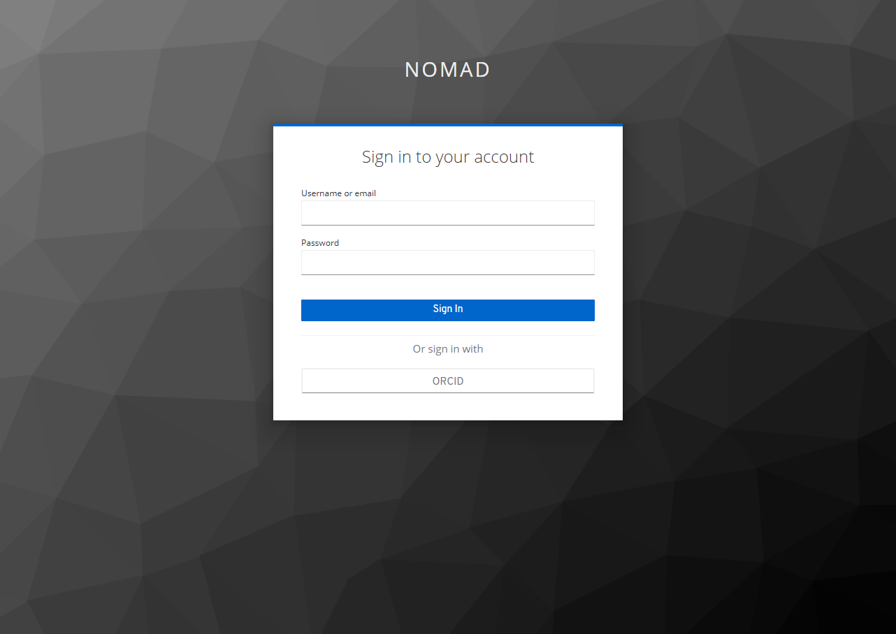
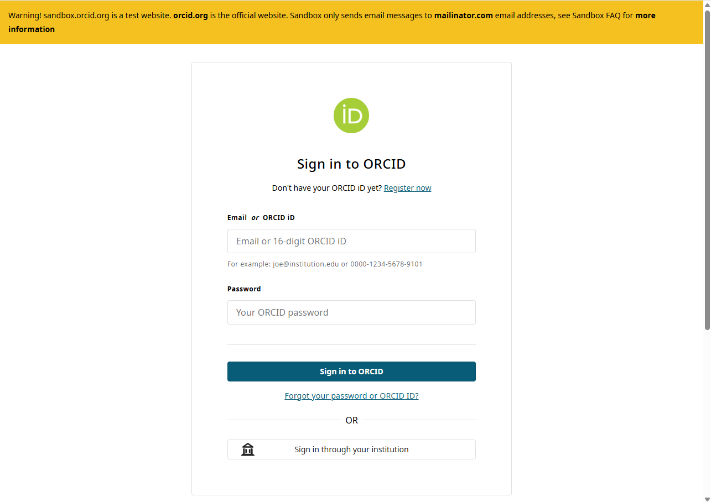
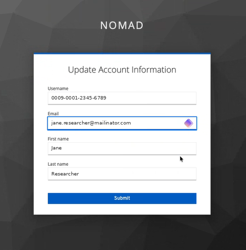
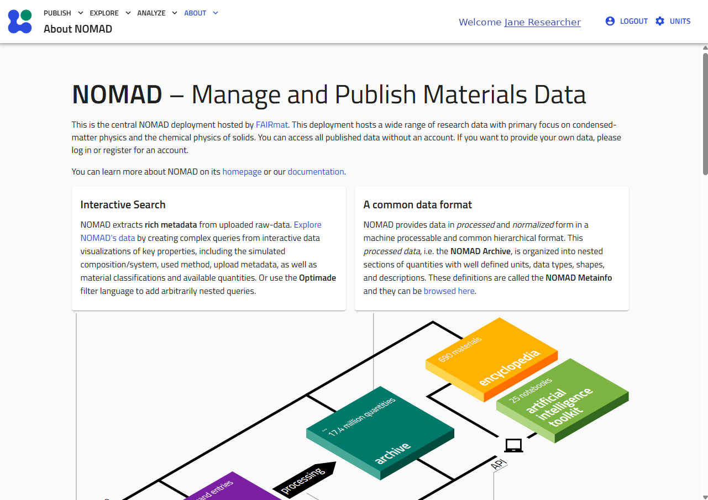

# Getting Started

The **Getting Started** guide introduces the CCP-NC Database staging platform and explains how to access its features for the first time.

Most of the database can be explored without creating an account. Authentication is only required for features that modify database content, such as uploading new datasets or updating existing metadata.

This guide covers:

- Accessing the staging website
- Searching the database without logging in
- Signing in using either email or ORCID Sandbox authentication
- First-time account setup
- Logging out
- Getting help if you encounter authentication problems

---

## Accessing the Staging Database

The CCP-NC Database staging website can be accessed directly from:

**[magres-staging.psdi.ac.uk](https://magres-staging.psdi.ac.uk/nomad-oasis/gui/about/information)**

The landing page introduces the staging deployment and provides access to the database through the navigation bar at the top of the page.

<figure markdown="1">
  
  <figcaption>The CCP-NC Database landing page as seen before signing in.</figcaption>
</figure>

The **Explore** menu provides access to the customised **CCP-NC NMR App**, which contains the search interface for computational NMR datasets.

---

## Searching Without an Account

One of the design goals of the CCP-NC Database is to make published computational NMR data easily discoverable.

You do **not** need to sign in to:

- Search the database
- Explore computational records and datasets
- Download publicly available data (check license information in the ccpnc metadata of the records before reusing)

Authentication is only required for actions that modify the database, including:

- Uploading datasets
- Editing metadata of your unpublished records and datasets

!!! tip "Start exploring immediately"
    If your goal is simply to search for published computational NMR data, you can begin using the database without creating an account.

---

## Authentication

The staging deployment currently supports two authentication methods:

1. **ORCID Sandbox authentication (recommended)**
2. **Email authentication**

Click **LOGIN / REGISTER** from the top navigation bar to open the authentication screen.

<figure markdown="1">
  
  <figcaption>The <strong>LOGIN / REGISTER</strong> link in the top navigation bar.</figcaption>
</figure>

This takes you to the sign-in screen, where both methods are available:

<figure markdown="1">
  
  <figcaption>The sign-in screen, offering both email/password and ORCID authentication.</figcaption>
</figure>

Choose the tab below for the method relevant to you:

=== "ORCID Sandbox Login"

    The recommended authentication method for most users is **ORCID Sandbox**.

    Select **ORCID** from the sign-in screen. You will be redirected to the ORCID Sandbox website to authenticate your account.

    
    <small>*The ORCID Sandbox sign-in page. The yellow banner confirms this is the sandbox service, not production ORCID.*</small>

    Because this is the **staging** deployment, authentication uses **ORCID Sandbox** rather than production ORCID accounts.

    If you have not previously created an ORCID Sandbox account, you will first need to register at **[sandbox.orcid.org](https://sandbox.orcid.org/)**.

    Your production ORCID credentials cannot be used with the staging system.

    !!! note "Why ORCID Sandbox?"
        The staging database uses the ORCID Sandbox service to allow authentication workflows to be tested without affecting users' main ORCID identities. Main ORCID authentication is not available for staging websites.

=== "Email Login"

    Email authentication is intended primarily for administrators and invited users.

    Because this is a staging deployment, email accounts are **not** self-service. An administrator must create your account before you can sign in using this method.

    Enter your registered email address and password directly on the sign-in screen shown above.

    If you have not been issued an account, use the **ORCID Sandbox Login** tab instead, or contact one of the database administrators.

---

## First-time ORCID Login

The first time you successfully authenticate using an ORCID Sandbox account, the database creates a local account associated with your ORCID identity.

Before completing the sign-in process, you will be asked to review your account information.

<figure markdown="1">
  
  <figcaption>The one-time account confirmation screen shown on your first successful ORCID Sandbox login.</figcaption>
</figure>

The confirmation page displays:

- ORCID identifier
- Email address
- Preferred first name
- Preferred last name

Review these details and select **Submit** to complete the account creation process.

This confirmation page is displayed **only once**. Future logins using the same ORCID Sandbox account will authenticate automatically and redirect you directly to the CCP-NC Database landing page.

---

## After Logging In

After successful authentication, you are returned to the CCP-NC Database homepage.

<figure markdown="1">
  
  <figcaption>The CCP-NC Database homepage after a successful login.</figcaption>
</figure>

The navigation bar now displays your authenticated session, and any features requiring authentication become available.

<figure markdown="1">
  
  <figcaption>The top navigation bar after login, showing your name and the <strong>LOGOUT</strong> option.</figcaption>
</figure>

---

## Logging Out

To end your authenticated session, select **LOGOUT** from the user menu in the navigation bar.

You will be returned to the public landing page.

Logging out does not affect any datasets or metadata stored in the database; it simply ends your current authenticated session.

---

## Administrator Contact

If you experience problems signing in or require an email account for the staging platform, please contact one of the database administrators — see [Support](reference/support.md) for current contact details.

---

## Troubleshooting

!!! warning "I cannot log in using my production ORCID account"
    The staging deployment authenticates against **ORCID Sandbox**. Production ORCID accounts cannot be used. If necessary, create a Sandbox account at [sandbox.orcid.org](https://sandbox.orcid.org/).

!!! warning "My email login does not work"
    Email accounts must be created by a database administrator before they can be used. If you have not received your account credentials, contact one of the administrators listed in [Support](reference/support.md).

!!! warning "I cannot find the upload functionality"
    The ability to upload datasets depends on your authentication status and account permissions. Ensure that you are signed in before attempting to upload data.

---

## Next Step

Once you have successfully accessed the staging platform, continue to the [Searching](user-guide/search.md) section to learn how to discover computational NMR datasets using the CCP-NC search interface, filter panels and global search tools.
