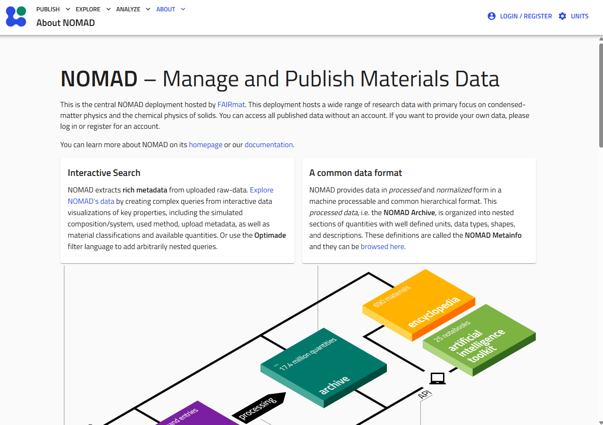

# Accessing the Site

The staging deployment is available at:

**[magres-staging.psdi.ac.uk](https://magres-staging.psdi.ac.uk/nomad-oasis/gui/about/information)**

The site is built on [NOMAD Oasis](https://nomad-lab.eu/), so the top navigation bar (**PUBLISH**, **EXPLORE**, **ANALYZE**, **ABOUT**) and general look and feel come from NOMAD itself, while the Magres-specific search filters, metadata schema, and dataset conventions are configured for solid-state NMR crystallography data.

## What you can do without an account

You do **not** need an account to:

- Browse and search all published entries in the database
- View entry details, computed NMR parameters, and metadata
- Download published `.magres` files and datasets

## What requires an account

You need to log in to:

- Upload your own calculations
- Create and manage datasets
- Edit metadata on entries you own

See [Logging In](authentication.md) for how to get access.
