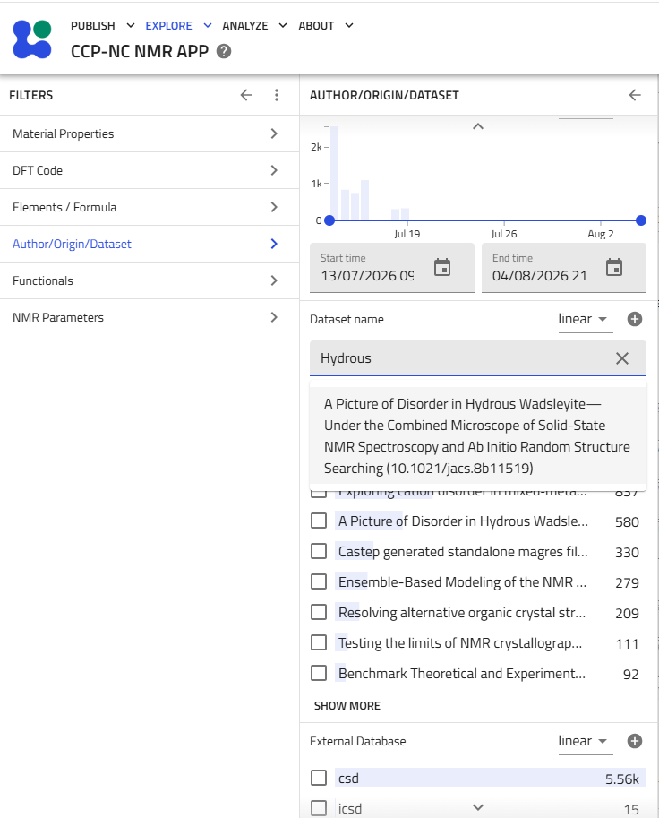
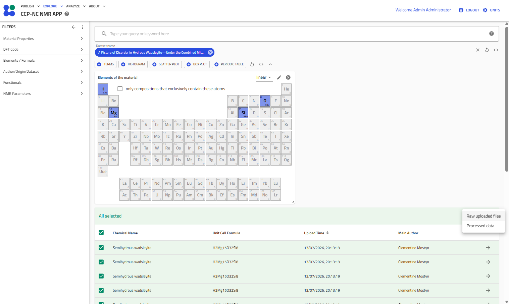
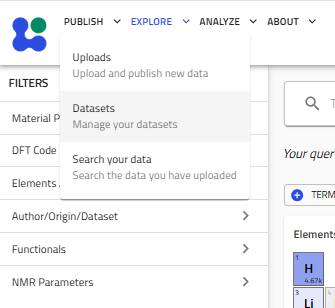
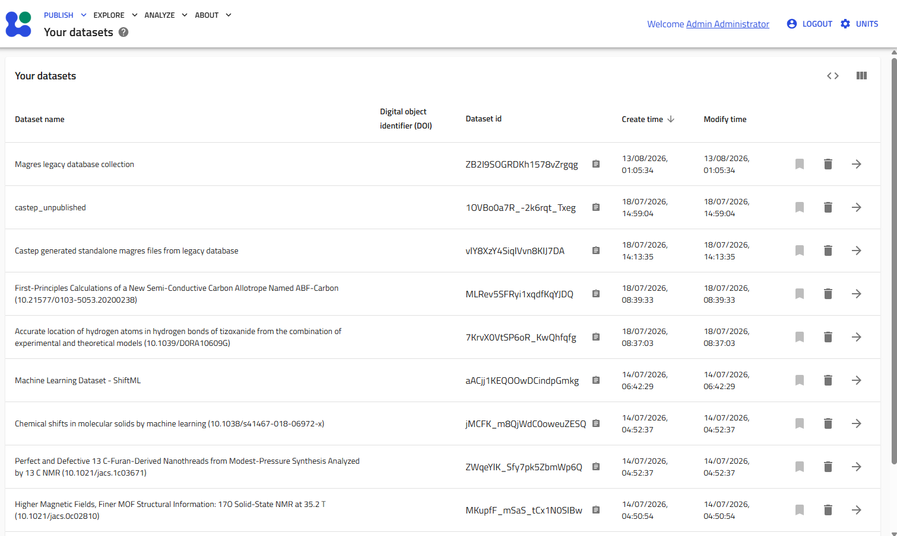
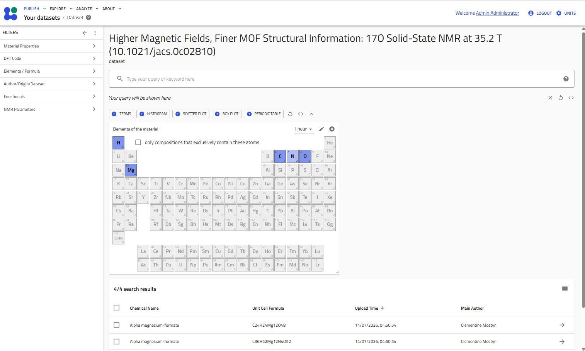
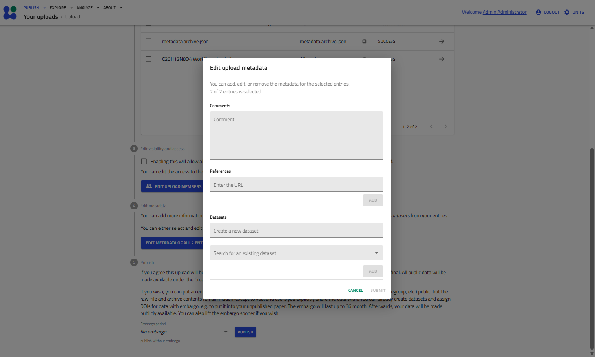

# Datasets

Datasets provide a convenient way to organise and manage related MAGRES records, typically corresponding to a publication, project, or computational study. Records belonging to the same dataset can be searched, filtered, explored and downloaded together.

---

## Searching datasets

Datasets can be searched directly from the **Author/Origin/Dataset** section of the filter panel.

Begin typing a dataset name into the **Dataset name** field. An autocomplete list of matching datasets will appear as you type. Selecting a dataset immediately filters the search results to records belonging to that dataset.

The remaining filter categories remain fully available, allowing the dataset contents to be narrowed further using:

- Material properties
- DFT code
- Elements and formula
- Functionals
- NMR parameters
- Any other supported metadata filters

For help on filtering using these fields, see the [Searching the Database](search.md) section. This allows users to locate specific subsets of records within a larger published dataset.

<figure markdown="1">
  
  <figcaption>Typing into the Dataset name box suggests matching datasets by their full title.</figcaption>
</figure>

---

## Exploring dataset contents

After selecting a dataset, the results table displays only records belonging to that dataset.

From this view you may:

- further refine the results using any available filters
- open individual record pages exactly as described in the [Viewing Results](results.md) section
- select multiple records using the checkboxes
- download the filtered results in bulk

Bulk downloading behaves identically to the standard search results page.

Click the **Download** button above the results table to choose between:

- **Raw uploaded files** — downloads the original uploaded files exactly as submitted.
- **Processed data** — downloads processed JSON representations that conform to the CCP-NC data schema.

<figure markdown="1">
  
  <figcaption>Results filtered to a single dataset, with all records selected and the Download menu offering Raw uploaded files or Processed data.</figcaption>
</figure>

---

## Managing your datasets

Users can manage datasets that they have uploaded through the **Publish** menu.

Select:

**Publish → Datasets**

to display all datasets that you own.

<figure markdown="1">
  
  <figcaption>The Publish menu: Uploads, Datasets, and Search your data.</figcaption>
</figure>

The **Your datasets** page lists all datasets associated with your account together with their identifiers and creation dates.

Selecting a dataset opens the dataset exploration view.

<figure markdown="1">
  
  <figcaption>The Your datasets page: dataset name, DOI, dataset ID, and create/modify times.</figcaption>
</figure>

Within an individual dataset you may:

- browse all records belonging to that dataset
- further filter records using the filter panel
- open individual record pages
- select records in bulk
- download filtered results exactly as described above

!!! note
    Occasionally the browser may need to be refreshed after opening a dataset before the correct dataset contents are displayed.

<figure markdown="1">
  
  <figcaption>The dataset exploration view: the dataset title and DOI applied as a filter, with the full search interface available to browse its records.</figcaption>
</figure>

---

## Creating datasets during upload

Datasets are created during the upload workflow.

While preparing an upload, select **Edit metadata** and either:

- enter the name of a new dataset, or
- assign the uploaded records to an existing dataset.

<figure markdown="1">
  
  <figcaption>The Edit upload metadata dialog: create a new dataset, or search for and assign an existing one.</figcaption>
</figure>

We recommend using descriptive dataset names.

For datasets associated with published work, use the publication title followed by the DOI in brackets. This maintains consistency with the legacy CCP-NC datasets already present in the database.

Example:

> Higher Magnetic Fields, Finer MOF Structural Information: 17O Solid-State NMR at 35.2 T (10.1021/jacs.0c02810)
