# Viewing Results

After performing a search, the filtered results appear in the search results area below the periodic table as seen in the figure below.

<figure markdown="1">
  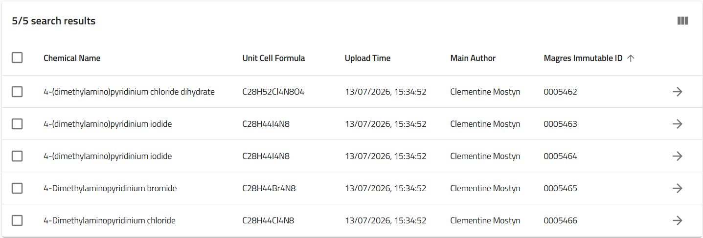
  <figcaption>The search results table, showing records matching the current search criteria.</figcaption>
</figure>

Clicking on one of the records allows for a quick overview of key metadata associated with that record. There are some default database appended metadata such as Formula, Entry type, and Entry name fields on the left side and Entry id, Upload id on the right end. 

The DFT program name and version information are automatically extracted by the magres parser. The metadata fields in the middle namely Comment, References, and Datasets in the middle column of this overview are entered by the user at the time of the upload. We recommend updating metadata in as much detail as possible to allow for other users to efficiently locate your records and associate them with the correst search results.

<figure markdown="1">
  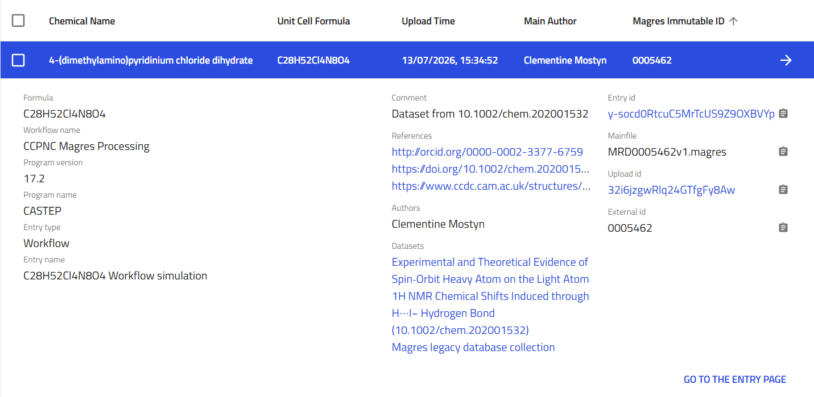
  <figcaption>The expanded row overview: database-appended fields (Formula, Entry type, Entry name) on the left, user-entered metadata (Comment, References, Authors, Datasets) in the middle, and record identifiers (Entry id, Mainfile, Upload id, External id) on the right.</figcaption>
</figure>

Clicking the right arrow at the right end of the record overview or clicking on **GO TO THE ENTRY PAGE** button at the bottom right of the overview allows the user to open the individual record page.

Each record represents a single computational NMR calculation together with its associated structure, computational metadata, uploaded files and parsed scientific data. The record page provides several complementary views that allow users to explore both a high-level summary and the complete underlying data extracted during parsing.

The record interface is organised into four main tabs:

- **Overview** — summary of the calculation, metadata and crystal structure.
- **Files** — uploaded source files and parsed file information.
- **Data** — complete parsed scientific data stored within the database.
- **Logs** — parser and processing logs generated during data ingestion.

---

## Overview Tab
The Overview tab is the default view when opening a record and is intended to give users immediate access to the most important scientific information without requiring navigation through the full parsed data model.

<figure markdown="1">
  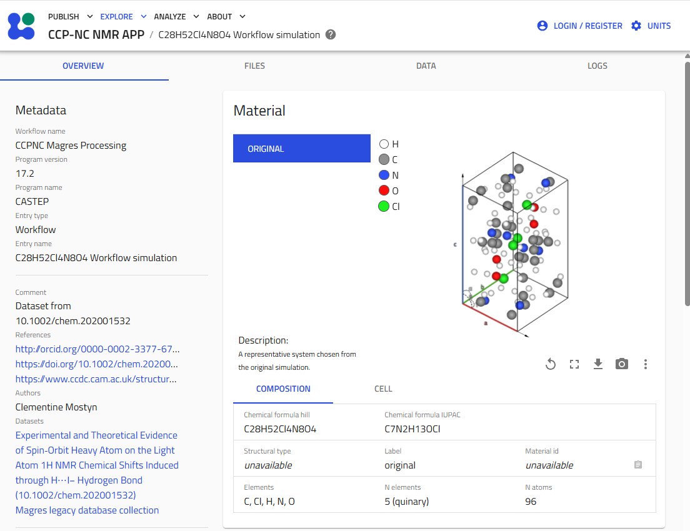
  <figcaption>The Overview tab: the Metadata panel on the left, and the interactive crystal structure viewer with the Composition tab open on the right.</figcaption>
</figure>

The Overview tab combines descriptive metadata with an interactive crystal structure viewer to provide a concise summary of each computational record.

### Metadata Panel

The left-hand metadata panel summarises the scientific and administrative information associated with the calculation.

Depending on the uploaded dataset, this may include:

- Workflow name
- Simulation code
- Simulation code version
- Entry name
- Publication references
- Authors
- Dataset membership
- Uploaded file name associated with the record
- Record identifiers
- Upload timestamps

Many entries contain hyperlinks to related resources such as:

- Publications (DOIs)
- ORCID profiles
- External crystallographic databases
- Related datasets within the CCP-NC Database

These metadata are the responsibility of the authors to declare at the time of uploading. Published records are immutable and are assigned a unique ***Entry id***. Multiple files in the same upload are assigned a common ***Upload id*** to group them. Once a record has been published, its scientific metadata cannot be modified by the user, as this requires administrator privileges.

### Interactive Crystal Structure Viewer

The centre of the Overview page contains an interactive visualisation of the representative crystal structure associated with the calculation.

Users may:

- Rotate the structure.
- Zoom in and out.
- Pan the view.
- Display the structure in full-screen mode.
- Capture the current view as an image.
- Download the displayed structure in multiple formats.

The viewer provides a convenient way to inspect the crystal structure before exploring the detailed computational results. Hover over the multiple buttons below the crystal structure to see what action each one triggers.

**Downloading the Crystal Structure**

The download button below the structure allows the currently displayed structure to be exported in the below commonly used structural formats:

- CIF
- XYZ
- PDB

Users may also choose whether the downloaded structure should be exported using:

- Original coordinates
- Wrapped coordinates
- Unwrapped coordinates

<figure markdown="1">
  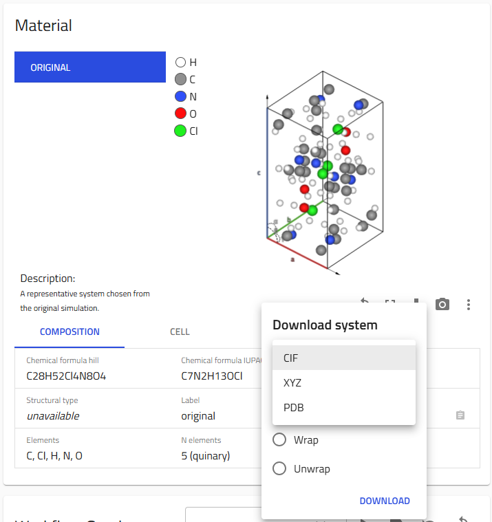
  <figcaption>The Download system menu: CIF, XYZ or PDB format, with Wrap/Unwrap coordinate options.</figcaption>
</figure>

**Display Options**

Additional visualisation settings are available from the three-dot menu beneath the crystal structure viewer.

These options allow users to customise the appearance of the structure by enabling or disabling features such as:

- Display of chemical bonds
- Display of lattice vectors
- Display of the simulation cell

The viewer also allows switching between the original, wrapped and unwrapped structural representations.

These controls affect only the visualisation and do not modify the stored data.

<figure markdown="1">
  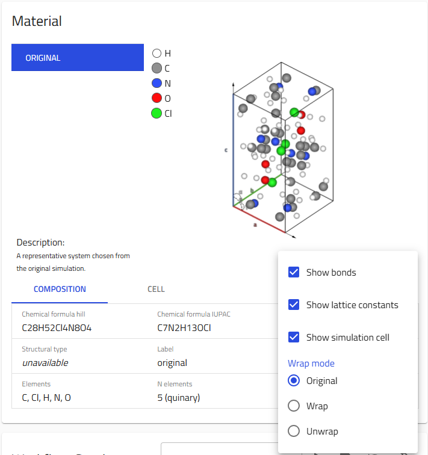
  <figcaption>The display options menu: toggle bonds, lattice constants and the simulation cell, and switch between original, wrapped and unwrapped views.</figcaption>
</figure>

### Composition and Cell Information

Below the crystal structure viewer are two tabs providing summary information about the representative material.

**Composition**

The Composition tab provides basic chemical information including:

- Chemical formula
- Chemical formula (IUPAC)
- Elements present
- Number of elements
- Number of atoms
- Structural label (where available)

This information provides a concise summary of the representative structure selected for the calculation.

<figure markdown="1">
  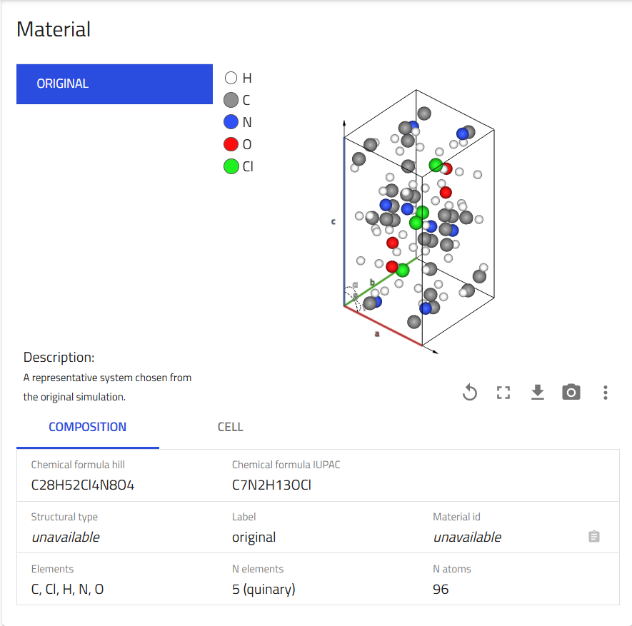
  <figcaption>The Composition tab: chemical formula (Hill and IUPAC), structural type, elements, and atom counts.</figcaption>
</figure>

**Cell**

The Cell tab summarises the crystallographic unit cell used in the simulation.

Available quantities include:

- Lattice parameters (a, b and c)
- Cell angles (α, β and γ)
- Cell volume
- Mass density
- Atomic density

<figure markdown="1">
  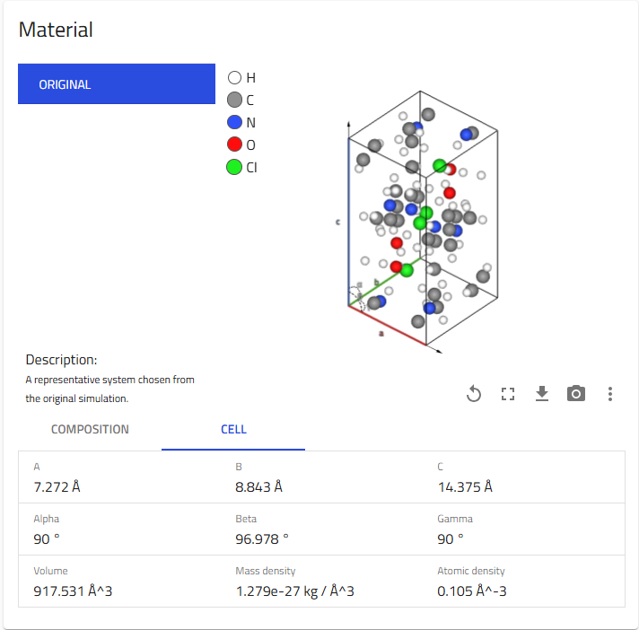
  <figcaption>The Cell tab: lattice parameters, cell angles, volume, and mass/atomic density.</figcaption>
</figure>

---

## Files Tab

The Files tab provides access to the files originally uploaded with the record together, which are listed in the left-hand panel (see figures below). These set of files are grouped together by default using an ***Upload id***.

<figure markdown="1">
  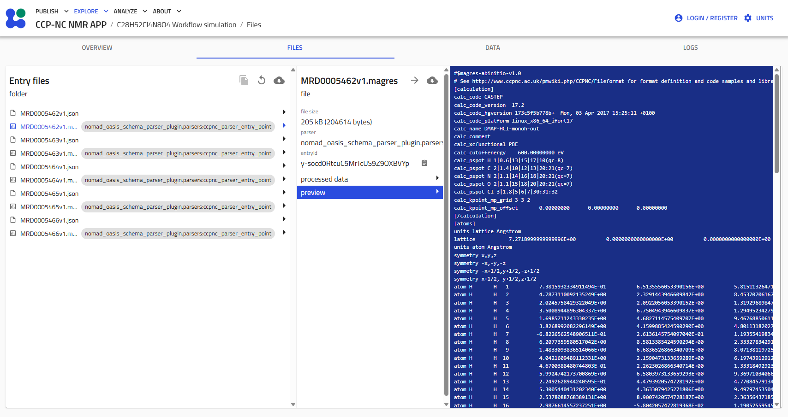
  <figcaption>Selecting a file shows its size, parser and entry ID, with the raw file <strong>preview</strong> displayed on the right.</figcaption>
</figure>

<figure markdown="1">
  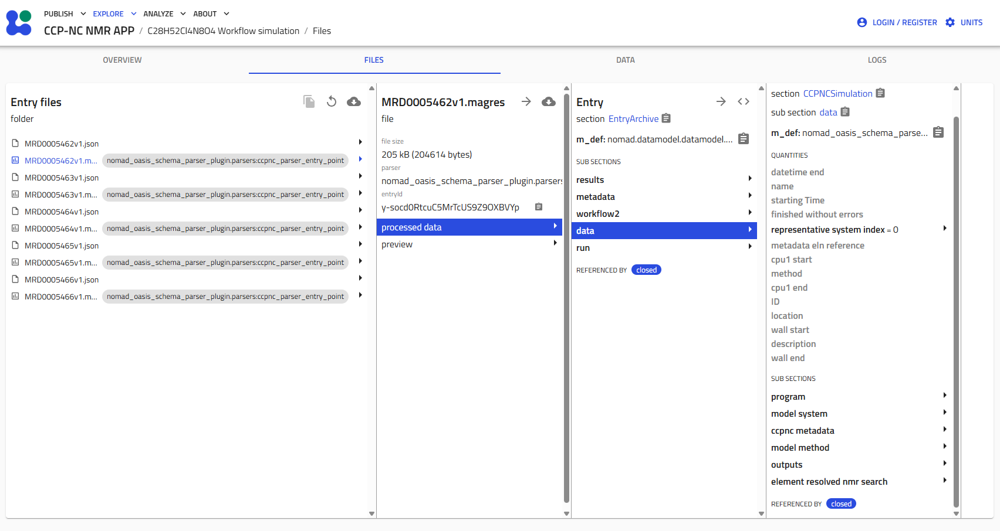
  <figcaption>Choosing <strong>processed data</strong> instead reveals the parsed entry, navigable through its sub-sections (results, metadata, workflow, data, run).</figcaption>
</figure>

Selecting a file displays information including:

- File size
- Parser used
- Entry identifier
- Parsed data (click *processed data* button)
- Raw File preview (click *preview* button)

Exploring the parsed data is explained in later sections.

### Downloading Complete Datasets

Many publications contain multiple computational records. While individual files can be downloaded from each record separately, downloading complete publications is often more efficient from the search results page.

The recommended workflow is:

1. Search for the publication (for example using its DOI).
2. Select all matching records.
3. Click the **Download** button above the search results.

This downloads all selected records simultaneously.

<figure markdown="1">
  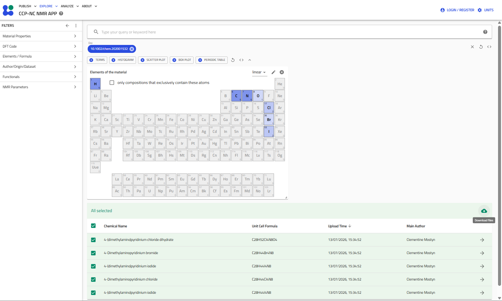
  <figcaption>All matching records selected on the search results page, with the <strong>Download files</strong> button available above the table.</figcaption>
</figure>

The download button offers two options:

1. Download the raw uploaded files, by cliking the *Raw uploaded files* option
2. Download records in the parsed form, by clicking *Processed data* option

!!! note
    Some very large legacy collections were divided into several uploads during migration to improve upload performance. Although these uploads remain linked through their shared publication metadata, downloading the complete publication from the search results page is generally the most convenient approach rather than from individual uploads.

    If you encounter errors with downloading files, report to the administrators. See [Support](../reference/support.md).

---

## Data Tab

The Data tab provides access to the complete parsed scientific representation of the record. Unlike the Overview tab, which presents a concise summary, this interface exposes the full hierarchical data model generated during parsing.

Users many primarily consult the Overview page, while the Data tab is intended for acquiring detailed computational information.

### Navigating the Parsed Data

The Data tab presents the record as a hierarchical tree. Successive columns allow users to navigate progressively deeper into the parsed data levels.

#### NMR Data

The parsed NMR results are stored within the **Outputs** section of the record. For each atomic site, the database stores both the complete tensor information and the commonly used derived quantities calculated from those tensors.

**Magnetic Shielding**

Each magnetic shielding entry contains:

- Full 3×3 shielding tensor
- Shielding isotropy
- Anisotropy
- Reduced anisotropy
- Span
- Skew
- Asymmetry
- Site label

Magnetic shielding values are displayed using the conventional **ppm** units.

<figure markdown="1">
  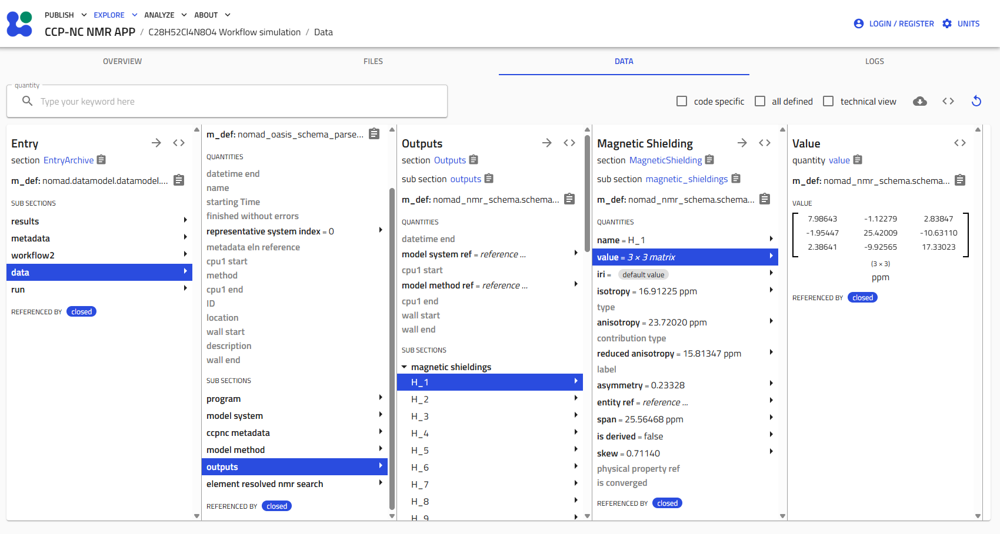
  <figcaption>Drilling into Entry → Outputs → Magnetic Shielding for site H_1: the full 3×3 tensor plus isotropy, anisotropy, reduced anisotropy, span, skew and asymmetry.</figcaption>
</figure>

**Electric Field Gradient**

Electric field gradient entries similarly provide:

- Full 3×3 EFG tensor
- Principal component (Vzz)
- Asymmetry parameter
- Additional derived quantities
- Site label

Electric field gradient values are displayed using the Hartree atomic units commonly adopted for computational NMR.

<figure markdown="1">
  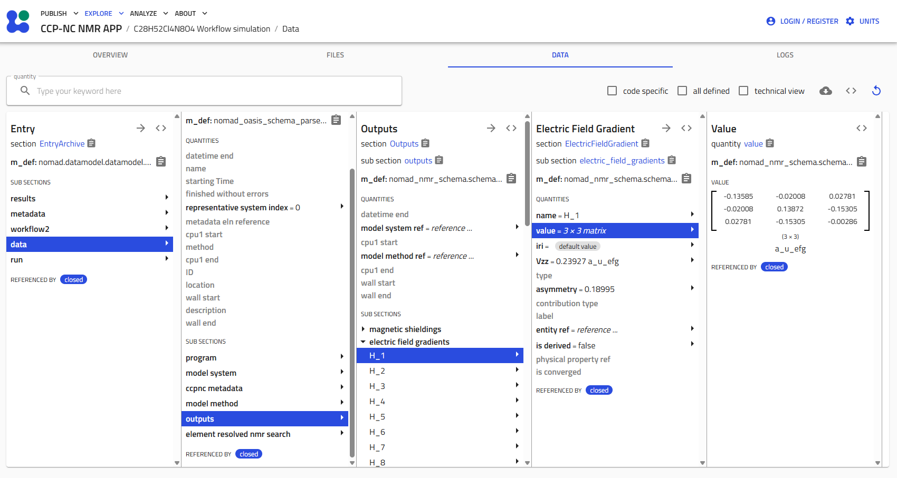
  <figcaption>The equivalent drill-down for Electric Field Gradient: the full 3×3 tensor plus Vzz and the asymmetry parameter.</figcaption>
</figure>

**Element-resolved NMR Summaries**

To simplify exploration of large structures, the CCP-NC parser automatically reorganises commonly used NMR quantities into element-specific sections. Instead of navigating every magnetic shielding or EFG tensor individually, users may browse values grouped by chemical element.

For magnetic shielding, isotropic values are organised by element.

For electric field gradients, the principal component (Vzz) is similarly grouped by element.

The original site labels extracted from the uploaded magres files are preserved throughout these summaries, making it straightforward to relate the simplified lists back to the full tensor data.

<figure markdown="1">
  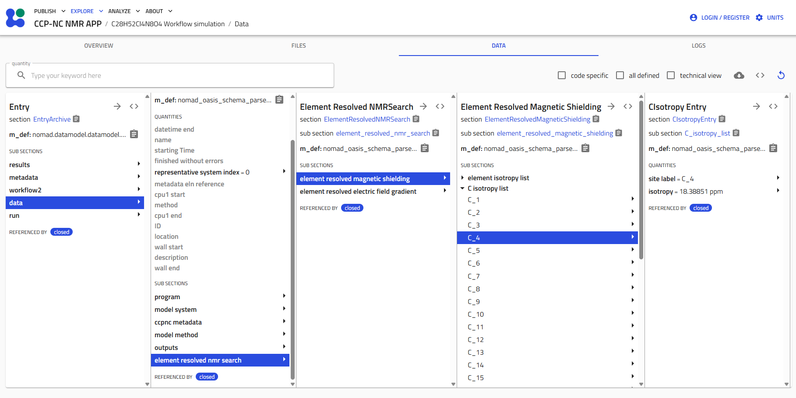
  <figcaption>Element Resolved Magnetic Shielding: isotropy values grouped by element (Carbon shown), drilling down to a single site's isotropy value.</figcaption>
</figure>

<figure markdown="1">
  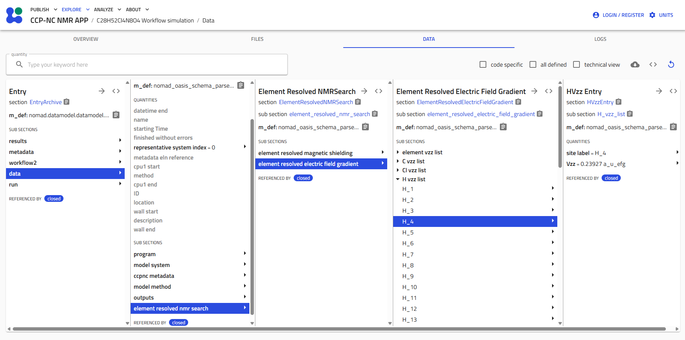
  <figcaption>Element Resolved Electric Field Gradient: Vzz values grouped by element (Hydrogen shown), drilling down to a single site's Vzz value.</figcaption>
</figure>

**Display Units**

The database allows displayed units to be customised using the **Units** button located in the upper-right corner of the interface.

Although users may choose alternative display units where available, the default unit selections follow the conventions used by the magres format and the computational solid-state NMR community.

<figure markdown="1">
  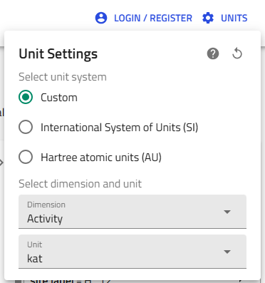
  <figcaption>The Unit Settings panel, opened from the <strong>UNITS</strong> button: choose a preset unit system (Custom, SI, or Hartree atomic units) or set individual dimensions and units.</figcaption>
</figure>

---

### Computational Metadata

Beyond the calculated NMR parameters, the Data tab also stores detailed information describing how each calculation was performed. These metadata provide the computational provenance required to reproduce or understand published calculations.

**Program Information**

The Program section contains information describing the electronic structure software used to perform the calculation.

Typical information includes:

- Program name
- Program version
- Execution date
- Additional program-specific metadata where available

<figure markdown="1">
  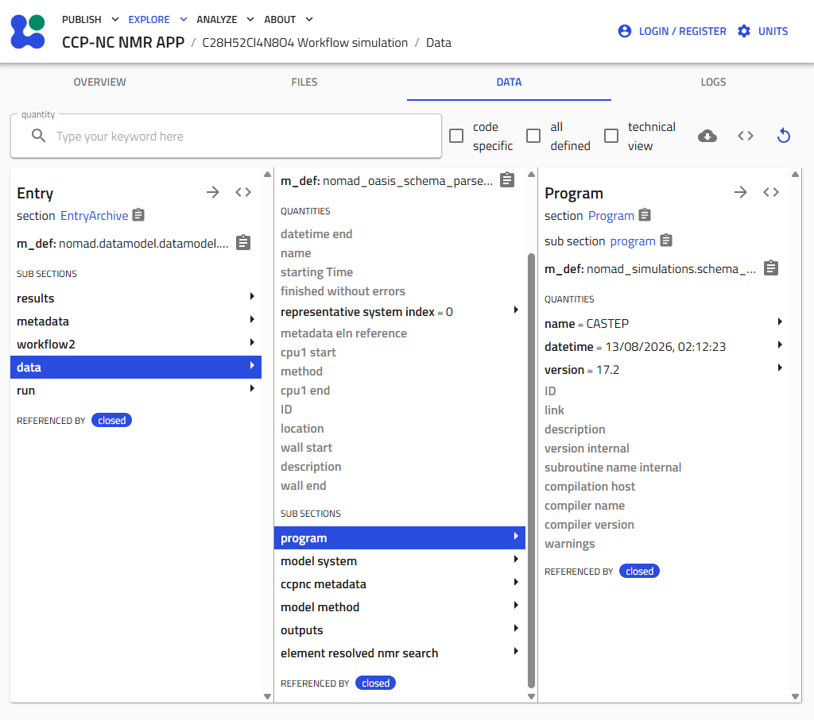
  <figcaption>The Program section: program name (CASTEP), version and execution date.</figcaption>
</figure>

**Model System**

The Model System section describes the simulated crystal structure itself. Depending on the calculation, this may include:

- Chemical formulae
- Lattice vectors
- Atomic positions
- Crystal symmetry
- Particle states
- Structural identifiers
- Coordinate systems

These metadata collectively define the atomic structure used during the simulation.

<figure markdown="1">
  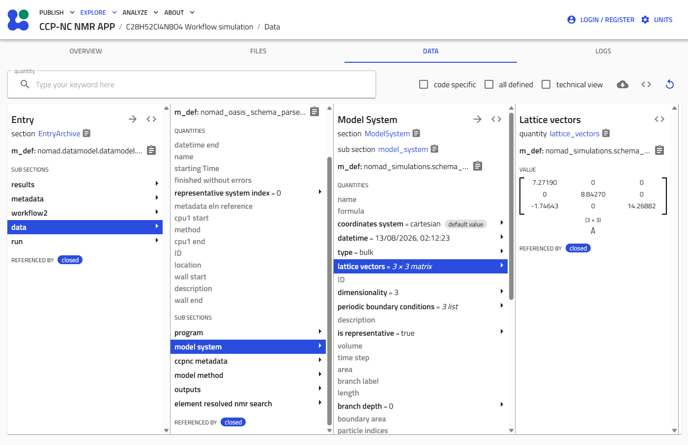
  <figcaption>Model System: the lattice vectors defining the simulation cell.</figcaption>
</figure>

<figure markdown="1">
  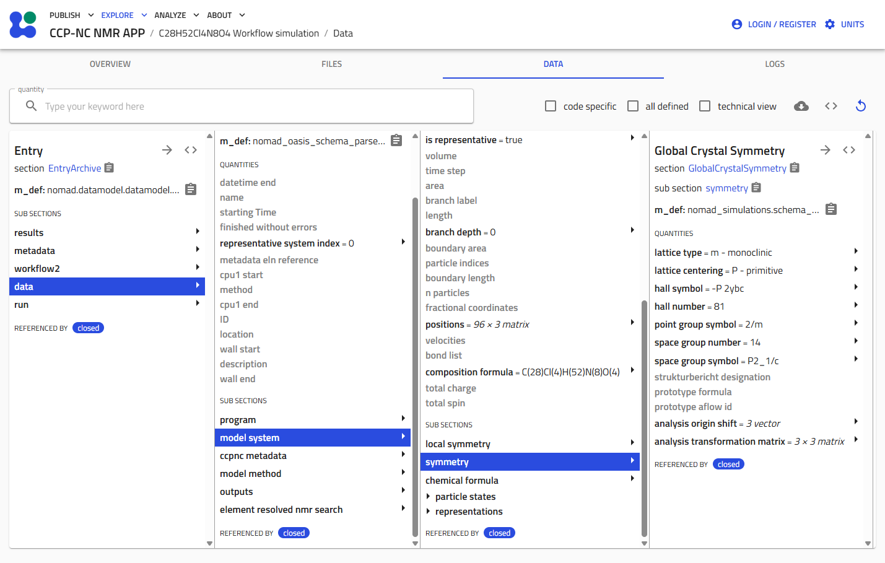
  <figcaption>Model System → symmetry: lattice type, point group, space group and related crystallographic descriptors.</figcaption>
</figure>

<figure markdown="1">
  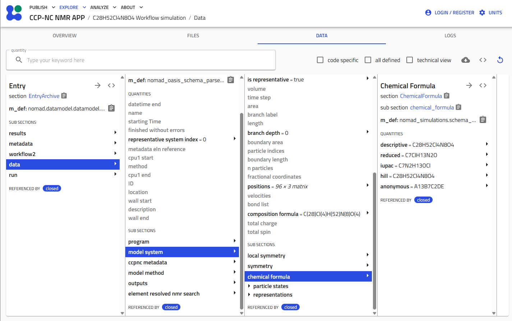
  <figcaption>Model System → chemical formula: descriptive, reduced, IUPAC, Hill and anonymous representations.</figcaption>
</figure>

<figure markdown="1">
  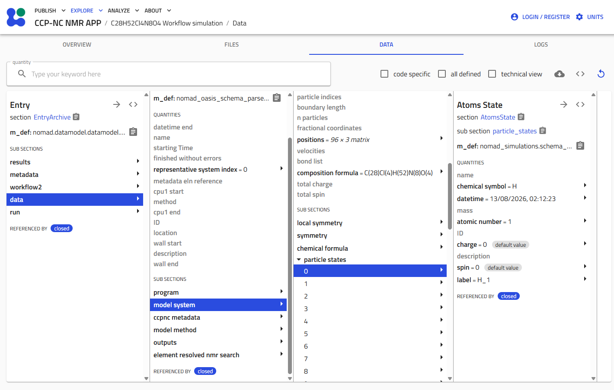
  <figcaption>Model System → particle states: per-atom information such as chemical symbol, atomic number and site label.</figcaption>
</figure>

**Model Method**

The Model Method section records the computational methodology used to generate the calculation. Depending on the originating electronic structure code, this may include:

- Basis set information
- K-space sampling
- Exchange-correlation functional
- Additional method-specific computational settings

These metadata provide essential provenance for reproducing published calculations and comparing results obtained using different computational approaches.

<figure markdown="1">
  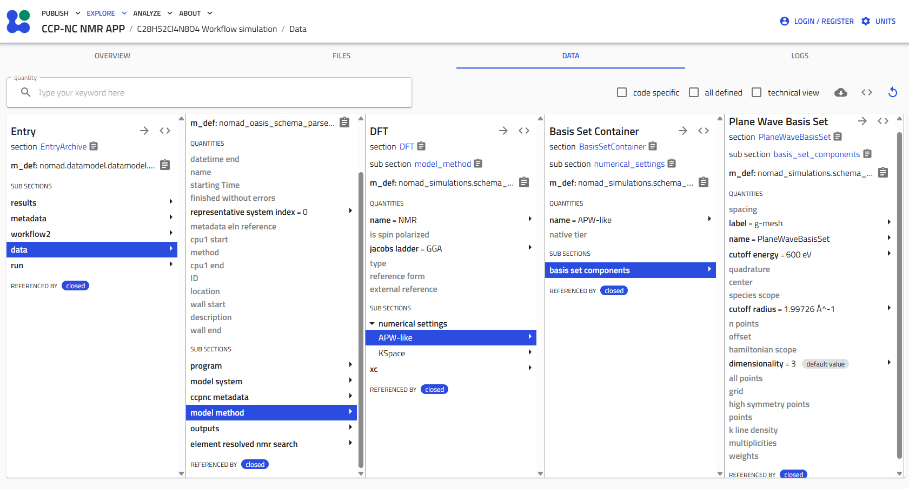
  <figcaption>Model Method → DFT → Basis Set Container: the plane-wave basis set and cutoff energy used.</figcaption>
</figure>

<figure markdown="1">
  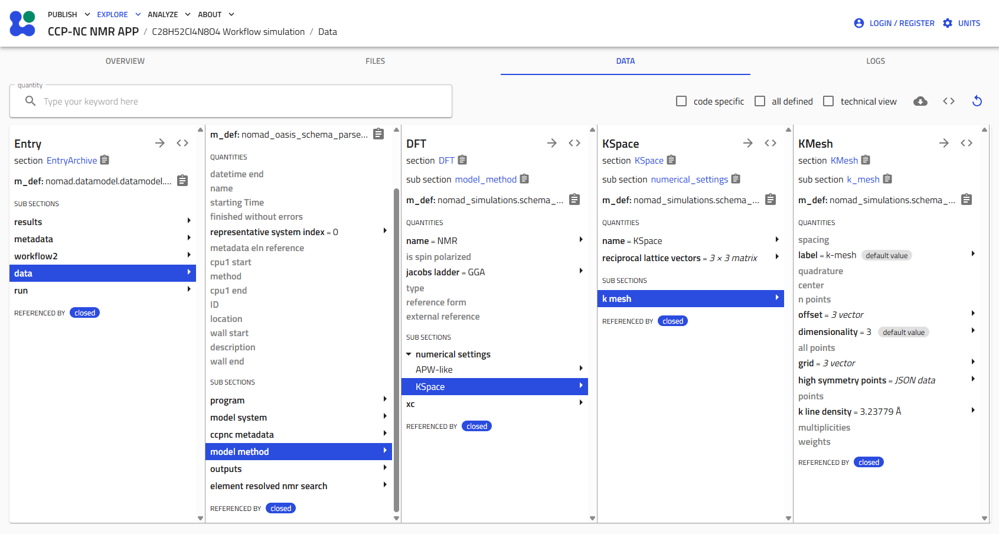
  <figcaption>Model Method → DFT → KSpace: the k-mesh sampling settings.</figcaption>
</figure>

<figure markdown="1">
  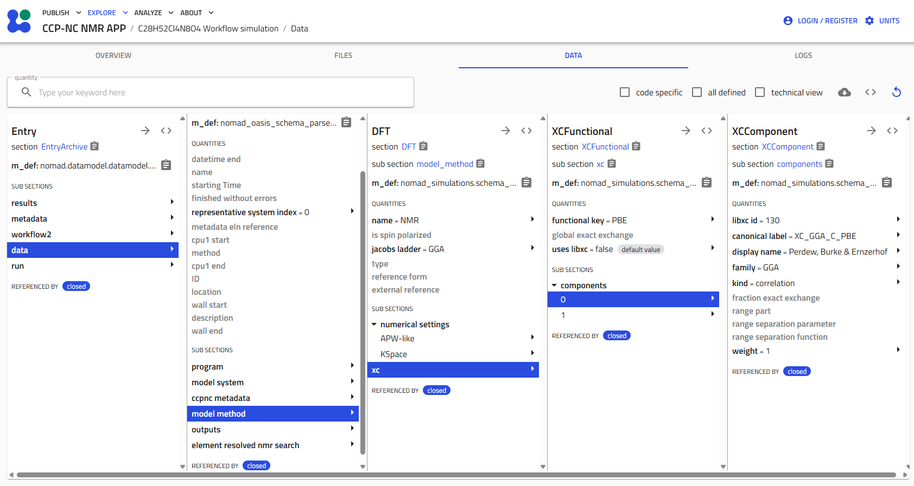
  <figcaption>Model Method → DFT → XC Functional: the exchange-correlation functional (PBE) and its components.</figcaption>
</figure>

---

### Logs Tab

The Logs tab records information generated while importing and processing uploaded files. This information is primarily intended for troubleshooting parser behaviour or diagnosing problems encountered during data ingestion.

Most users exploring published datasets will not normally need to consult this section. Parser logs may however be useful when investigating upload failures or verifying how particular quantities were extracted from uploaded files.
