# Searching the Database

You can search and explore the database with or without a user account — see [Accessing the Site](../getting-started.md#accessing-the-staging-database).

## Overview

The CCP-NC Database provides several complementary methods for discovering computational NMR records. Depending on the information already available to you, searches can be performed using structured metadata filters, the global search bar or the interactive periodic table.

Many searchable fields are accessible using more than one search tool. Throughout this guide, the recommended workflow for each search field is explained together with worked examples, helping you choose the most effective search method for your particular task.

---

## Understanding the Search Interface

The search workspace is organised into four main components:

1. **Search filter panel**, used for filtering structured metadata and numerical ranges.
2. **Global search bar**, used for constructing flexible metadata queries through the NOMAD search interface.
3. **Interactive periodic table**, used for filtering records according to their elemental composition.
4. **Search results table**, which displays the records matching the current search criteria.

<figure markdown="1">
  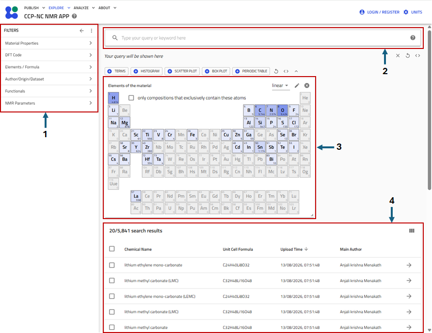
  <figcaption>The four main components of the search workspace: (1) the search filter panel, (2) the global search bar, (3) the interactive periodic table, and (4) the search results table.</figcaption>
</figure>

These components work together and can be used independently or in combination to progressively narrow your search results.

---

## About the Search Tools

The CCP-NC Database offers multiple ways to search the same underlying metadata, allowing users to choose the approach best suited to the information they already have.

The **search filter panels** and **interactive periodic table** provide intuitive graphical interfaces for filtering records and generally require little explanation. Worked examples demonstrating these tools are included throughout the relevant sections of this guide.

The **global search bar** provides greater flexibility by allowing searches to be constructed directly from the metadata stored within each database record. Although the exact search differs depending on the field being queried, the general workflow remains consistent:

1. Begin typing the name of the metadata field you wish to search.
2. Select the appropriate field from the autocomplete suggestions.
3. After selecting the field, enter an **equals sign** (`=`) followed by the value you wish to search for. Where available, the search bar will provide autocomplete suggestions for matching values.
4. Choose the appropriate search type (for example, **Equality** or **Free-text**, where available).
5. Review the matching records returned by the search.

The precise sequence of selections and available search options varies slightly between metadata fields. Rather than attempting to describe every possible variation here, the following sections provide worked examples for each searchable field, demonstrating the complete search workflow together with the recommended search method.

---

## Search Results Table

The search results table displays all records matching the current search criteria.

Each row represents an individual computational NMR record and provides a summary of its metadata. By default, the staging deployment displays the following columns:

- Chemical Name
- Unit Cell Formula
- Upload Time
- Main Author

These columns were selected to provide a concise overview of each record while keeping the results table easy to scan.

<figure markdown="1">
  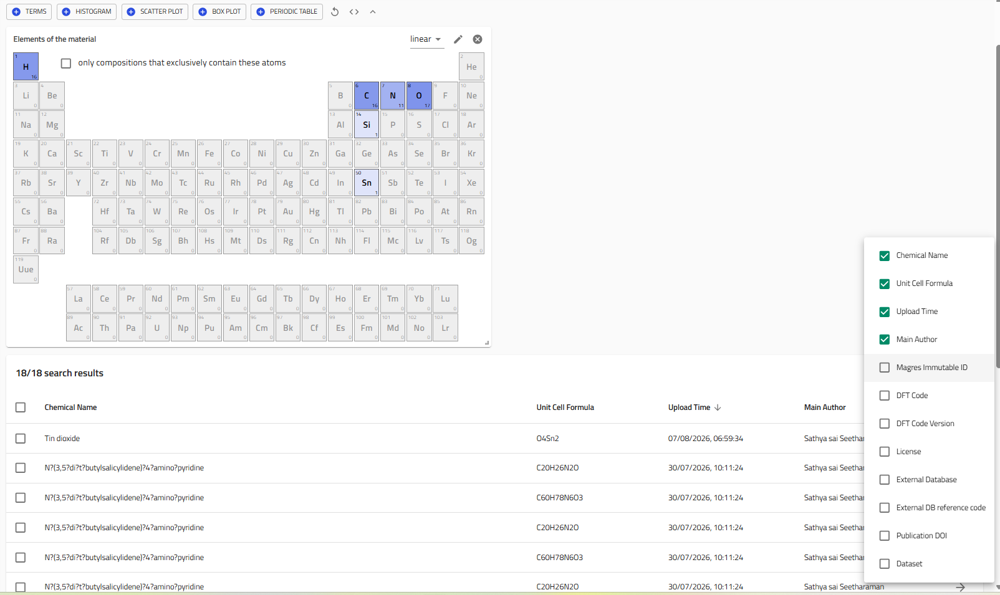
  <figcaption>The default results table (Chemical Name, Unit Cell Formula, Upload Time, Main Author), shown with the column configuration menu open to reveal the full set of optional columns.</figcaption>
</figure>

### Customising Displayed Columns

The displayed columns can be customised to show additional metadata relevant to your search.

Select the **column configuration** button ({ width="26" style="vertical-align:middle" }) on the top right of the results table to open the list of available column choices.

Tick or untick individual checkboxes to control which metadata fields are displayed. Changes are applied immediately without needing to repeat the search.

The staging deployment currently supports the following optional columns:

- Magres Immutable ID (legacy records only)
- DFT Code
- DFT Code Version
- Data Distribution License
- External Database
- External Database Reference Code
- Publication DOI
- Dataset

!!! tip "Tailor the results table to your workflow"
    If you frequently search using a particular metadata field, consider enabling the corresponding column. This allows matching values to be reviewed directly from the search results without opening every individual record.

For example:

- Enable **DFT Code** and **DFT Code Version** when comparing calculations performed using different electronic structure codes.
- Enable **External Database** and **External Database Reference Code** when comparing CCP-NC records with entries in external crystallographic databases.

### Sorting Results

Some columns support sorting.

Where available, cicking the column heading sorts the search results in ascending or descending order. The current sort direction is indicated by the arrow displayed beside the column name.

This can be particularly useful when reviewing recently uploaded records by sorting the **Upload Time** column, for example, as seen in the figure above.

!!! note "Staging deployment"
    The available columns and sorting options may evolve as additional metadata fields and search capabilities are introduced in future releases of the CCP-NC Database.

---

## Search Fields

The table below organises every single metadata field by which you can filter the database records. The second and third columns show whether the field is searchable via the filter panel menu on the screen left or the global search bar at the top of the screen, using tick marks. The fourth column shows the most recommended method to search the particular field. The subsequent sections contain worked example screenshots for each field, which you can refer to independently.

| Search Field | Filter Panel | Search Bar | Recommended Method | Notes |
|---|---|---|---|---|
| Material Name | ✓ | ✓ | Filter panel for exact names; search bar for partial names | Free-text supported |
| DFT Code | ✓ | ✓ | Equality | Filter panel recommended |
| Program Version | ✓ | ✓ | Equality | Exact version |
| Chemical Formula | ✓ | ✓ | Equality | Avoid free-text for short formulae |
| Elements | ✓ | ✓ | Filter panel / Periodic Table | Composition search |
| Author | ✓ | ✓ | Equality | Filter panel preferred |
| Immutable ID | ✓ | ✓ | Equality | Seven-digit identifier |
| External Database | ✓ | ✓ | Equality | Lowercase names |
| External Database Reference Code | ✓ | ✓ | Depends | REFCODE behaviour differs |
| Publication DOI | ✓ | ✓ | Equality | Free-text for DOI fragments |
| XC Functional | ✓ | ✓ | Equality | Avoid substring matches |
| Magnetic Shielding | ✓ | Limited | Filter panel | Histogram search |
| Electric Field Gradient (Vzz) | ✓ | Limited | Filter panel | Histogram search |

---

## Searching - Worked Examples

### Material Name
Material names provide one of the simplest ways of locating records within the CCP-NC Database. Searches may be performed using either the **Material Properties** filter panel or the **Global Search Bar**, depending on whether the complete material name or only part of the name is known.

Material names are stored exactly as supplied by the dataset author. Consequently, IUPAC names, common names and author-specific naming conventions are all searchable.

**Search using the Filter Panel**

The **Material Properties** filter is located at the top of the search filter panel. There is no search text box in this filter menu for seraching material properties. The material list is ordered by the frequency with which each material occurs in the database, with the most common entries appearing first. Use checkboxes for quickly filtering materials by name. Users may click `SHOW MORE` to further expand the list and `SHOW LESS` later to contract it.

<figure markdown="1">
  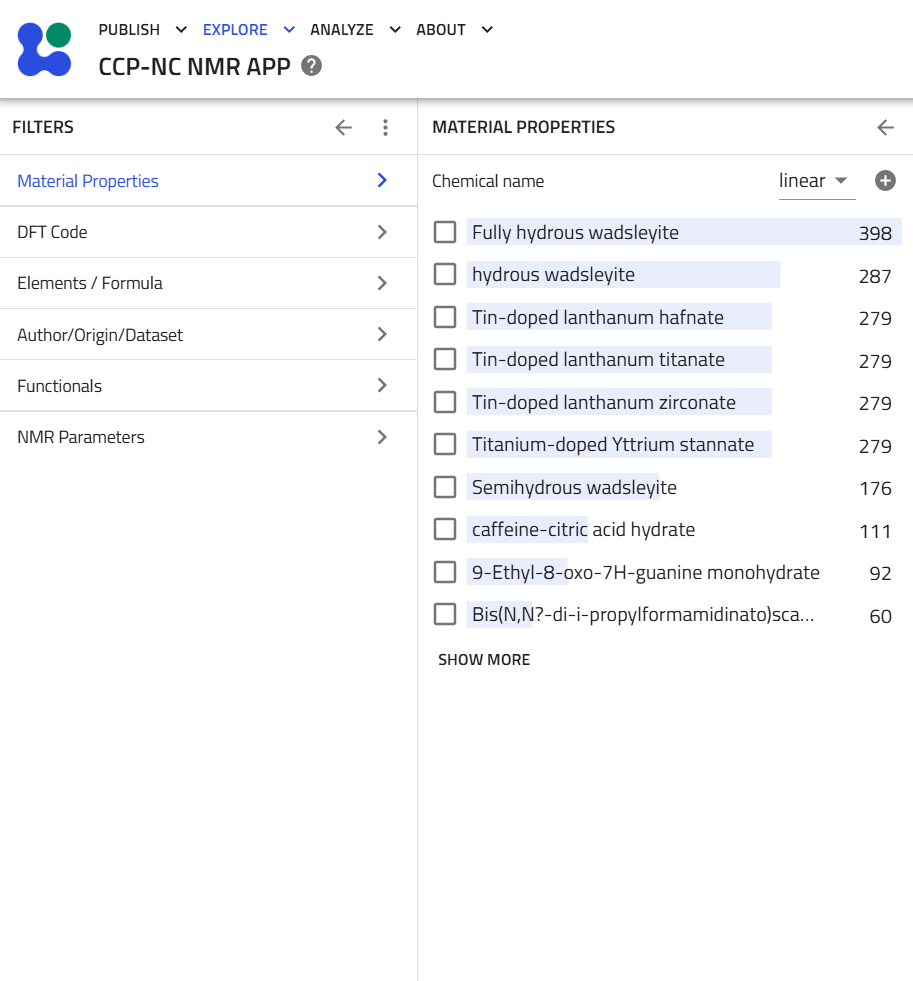
  <figcaption>The Material Properties filter, listing chemical names ordered by frequency of occurrence, with a "SHOW MORE" link to expand the list.</figcaption>
</figure>

**Search using the Global Search Bar**

Begin typing `chemical name` in the Global Search Bar and select the metadata field `data.ccpnc_metadata.material_properties.chemical_name` from the autocomplete suggestions.

<figure markdown="1">
  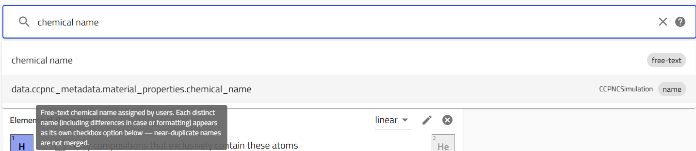
  <figcaption>Selecting the <code>data.ccpnc_metadata.material_properties.chemical_name</code> field from the autocomplete suggestions after typing "chemical name".</figcaption>
</figure>

After selecting the field, enter an equals sign (`=`) followed by the search term.

If only part of the material name is known, select **Free-text** search. Free-text searches are particularly useful when searching for common fragments of long IUPAC names and materials with common names.

For example, searching for:

`methyl`

returns records containing terms such as:

- methyl
- dimethyl
- methylphenyl

Wildcard searches may also be used where appropriate.

For example,

`methyl*`

restricts matches to occurrences beginning with *methyl*, although punctuation used within IUPAC names means wildcard behaviour should be interpreted with care.

<figure markdown="1">
  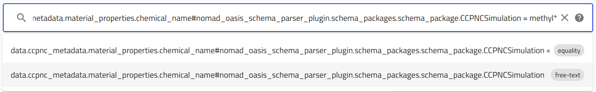
  <figcaption>A free-text search for <code>methyl*</code>, restricting matches to names beginning with "methyl".</figcaption>
</figure>

<figure markdown="1">
  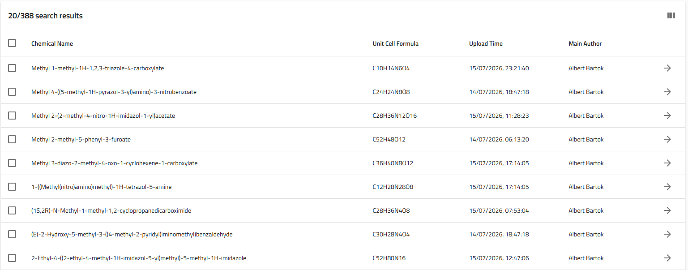
  <figcaption>The 388 matching records returned by the free-text <code>methyl*</code> search.</figcaption>
</figure>

Where the exact material name is known, select **Equality** search and enter the complete string following the `=` sign. For example, an entry such as:

`2-(((2,3-Dihydroxypropyl)iminio)methyl)-4-nitrophenolate`

must be entered substantially as stored in the database.

<figure markdown="1">
  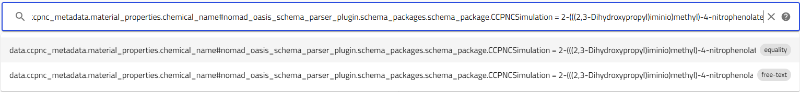
  <figcaption>An equality search using the complete name, as stored in the database.</figcaption>
</figure>

<figure markdown="1">
  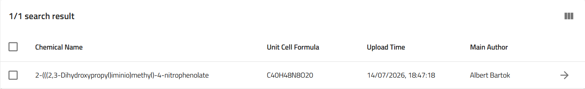
  <figcaption>The single, exact-match record returned by the equality search.</figcaption>
</figure>

**Best Practice**

!!! tip

    Use the **Filter Panel** when the material name is known and found with high frequency in the database.

    Use the **Global Search Bar** when only part of the material name is available or when searching long systematic names.

---

### Program name (DFT Code)
The CCP-NC Database allows records to be filtered according to the electronic structure code used to generate the calculation.

**Search using the Filter Panel**

The **Filter Panel** is the recommended method for filtering records by DFT code. 

The program name filter contains all electronic structure codes currently represented within the database and can be found under the **DFT Code** filter menu. Select the desired code using the available checkboxes.

Results may be refined further by selecting one or more program versions. Program versions are ordered according to their frequency within the database rather than numerical order.

<figure markdown="1">
  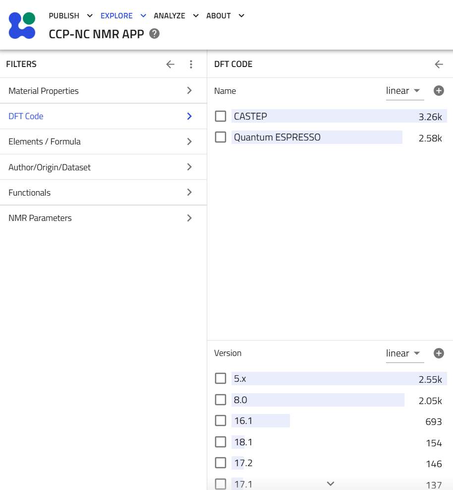
  <figcaption>The DFT Code filter, listing program names (CASTEP, Quantum ESPRESSO) and program versions, each ordered by frequency of occurrence.</figcaption>
</figure>

**Using the Global Search Bar**

Begin typing `program` and select the metadata field `results.method.simulation.program_name` from the autocomplete suggestions.

After selecting the field, enter the `=` sign followed by the required program name. Choose **Equality** search. Equality search is recommended because program names represent structured metadata. Remember that the equality search is case-sensitive, it is recommended to choose the entry suggested by the autocomplete feature.

<figure markdown="1">
  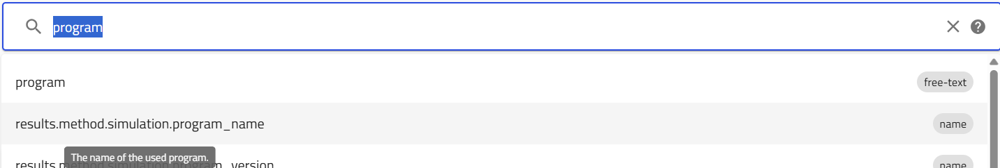
  <figcaption>Selecting <code>results.method.simulation.program_name</code> after typing "program".</figcaption>
</figure>

<figure markdown="1">
  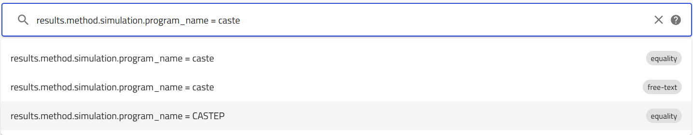
  <figcaption>Choosing the autocomplete-suggested equality search for <code>CASTEP</code>.</figcaption>
</figure>

---

### DFT Code Version
Program version searches allow calculations to be restricted to a particular release of an electronic structure code.

**Search using the Filter Panel**

The **Filter Panel** is recommended for filtering records by DFT code version, just like in teh case of DFT code name filter. 

Program versions list is listed beneath the Program Name list under the main **DFT Code** filter menu. Select one or more versions using the available checkboxes. Multiple versions may be selected simultaneously to search across a version range.

<figure markdown="1">
  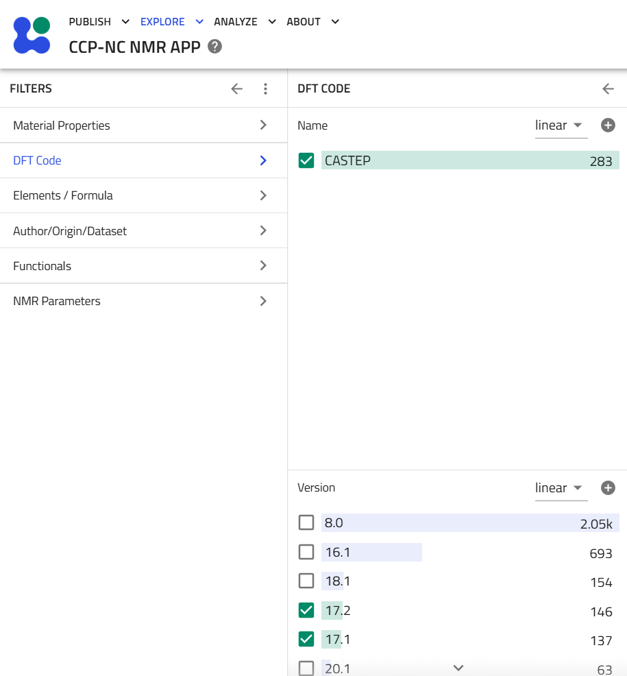
  <figcaption>CASTEP selected as the program name, with versions 17.1 and 17.2 both checked to search across a version range.</figcaption>
</figure>

**Using the Global Search Bar**

Begin typing `version` and select the metadata field `results.method.simulation.program_version` from the autocomplete suggestions.

After selecting the field, enter the `=` sign followed by the required program version number. Autocomplete suggestions display the program versions currently represented within the database, that are closest to the typed search field. Select the required value using **Equality** search.

**Note:** There is no direct method to implement a range filter on the program versions. Therefore, the above step has to be repeated as many times as needed to apply as many version number filters.

<figure markdown="1">
  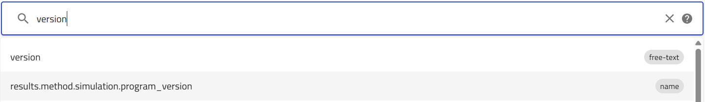
  <figcaption>Selecting <code>results.method.simulation.program_version</code> after typing "version".</figcaption>
</figure>

<figure markdown="1">
  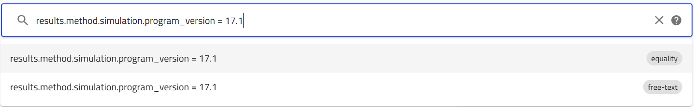
  <figcaption>Applying an equality search for version <code>17.1</code>.</figcaption>
</figure>

<figure markdown="1">
  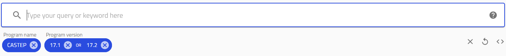
  <figcaption>The result after repeating the search bar steps: a <strong>CASTEP</strong> program name filter combined with two program version filters (<strong>17.1 OR 17.2</strong>).</figcaption>
</figure>

---

### Chemical Formula
Chemical formulae may be searched using either the Filter Panel or the Global Search Bar. The database supports formula searches using standard crystallographic conventions.

**Using the interactive periodic table**

The periodic table in the main data exploration page can be used for quickly filtering records that contain only specific elements, before the targeted formula based search.

<div class="figure-row" markdown="1">

<figure markdown="1">
  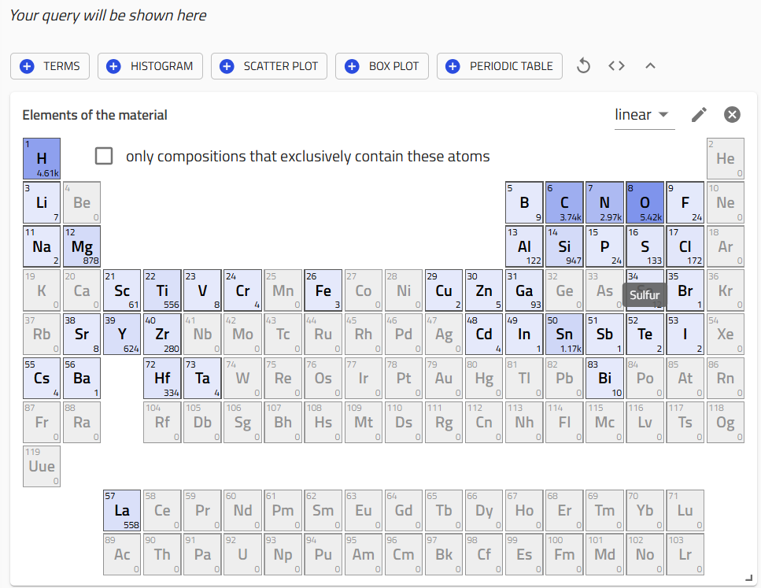
  <figcaption>Hovering over the Sulfur tile before selecting it.</figcaption>
</figure>

<figure markdown="1">
  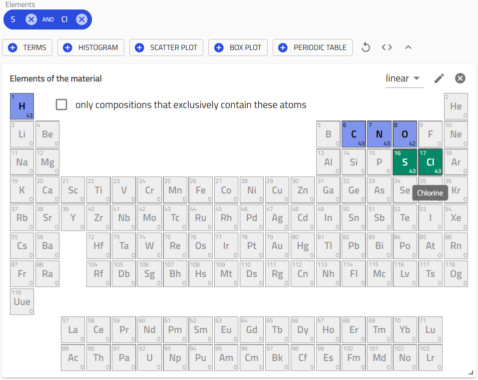
  <figcaption>Results narrowed to records containing both Sulfur <strong>and</strong> Chlorine.</figcaption>
</figure>

</div>

**Using the Filter Panel**

The filter panel offers an **Elements/Formula** menu where a user can search for chemical formulae in the IUPAC or Hill conventions using the search text box provided. These search fields are case-sensitive and require the search query to be exact matches. But, these search text boxes contain auto-completion suggestion feature that will offer you helpful suggestions as you start typing in the formula.

<figure markdown="1">
  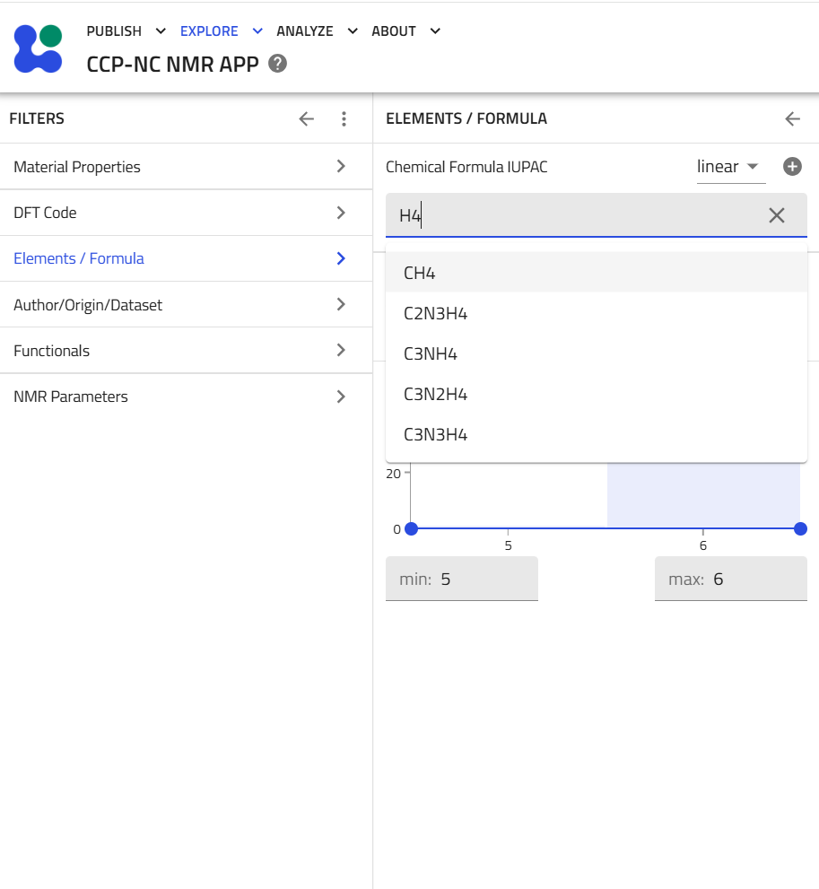
  <figcaption>Typing <code>H4</code> into the Chemical Formula IUPAC box brings up matching autocomplete suggestions; the N elements histogram below is set to a min/max range of 5–6.</figcaption>
</figure>

The filter panel also offers a histogram to further filter records by the number of constituent elements in the target material. Drag the mouse to control the sliders on the histogram directly or enter values for minimum and maximum number of elements in the corresponding text boxes below the histogram. **Note:** The min and max values can be equal if only a single search value is preferred. Try different combinations of values to get familiar.

**Using the Global Search Bar**

The search bar offers a slightly broader search functionality for formula than the filter menu. In the search bar, start typing `formula` which by default brings up 4 conventions - **Hill**, **IUPAC**, **Reduced**, **Anonymous** - in which each material is represented on the database. 

Select the preferred formula field, as per requirement. **Note:** Scroll down the auto-suggestion menu to choose from `data.model_system.chemical_formula.*`,as this aligns with a newer NOMAD data model for storing formula information. Then, follow the field name with the `=` sign and your search string. **Equality** search works best for chemical formulae, so take care to type in the complete string to perform an exact string match.

For example, here we show search performed by choosing IUPAC convention and **Equality** search.

<figure markdown="1">
  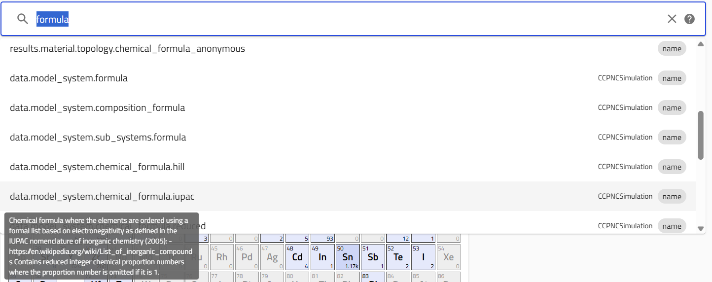
  <figcaption>Scrolling to <code>data.model_system.chemical_formula.iupac</code> (tagged <strong>CCPNCSimulation</strong>) after typing "formula".</figcaption>
</figure>

<figure markdown="1">
  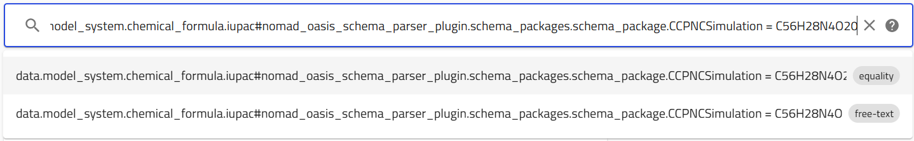
  <figcaption>Applying an equality search for the complete IUPAC formula.</figcaption>
</figure>

---

### Search by Elements
**Using the Interactive Periodic Table**

The periodic table provides a graphical, straightforward method for filtering records according to elemental composition. Only elements currently represented within the filtered dataset are displayed as active (blue tiles). Darker the blue tiles, the higher the frequency of occurrence of that element in the overall/filtered dataset. Ele,ents that don't occur in any records are greyed out.

Selecting an element immediately restricts the search results to records containing that element. Following each selection, elements that are no longer present within the filtered records are greyed out automatically. Additional elements may then be selected to progressively narrow the search.

For example:

1. Select **Sulphur**.
2. Review the updated periodic table.
3. Select **Chlorine** to restrict the results further.

<div class="figure-row" markdown="1">

<figure markdown="1">
  
  <figcaption>Step 1: hovering over Sulfur, before selection.</figcaption>
</figure>

<figure markdown="1">
  
  <figcaption>Step 3: results narrowed to records containing both Sulfur and Chlorine.</figcaption>
</figure>

</div>

**Best Practice**

!!! tip

    The Filter Panel and Global Search Bar are generally more appropriate when element searches need to be combined with additional metadata filters.

---

### Author

Author searches allow records to be located according to the primary author associated with a computational dataset. Searches may be performed using either the **Author** filter within the search panel or the **Global Search Bar**.

**Using the Filter Panel**

The **Author / Origin / Dataset** filter contains a searchable list of all authors represented within the database. The filter panel is the fastest and most recommended way to search by author metadata field.

Begin typing the author's name into the search box or select the required author directly from the list of available values. The search text box provides autocomplete suggestion as the name is being typed to help choose the author names faster.

<figure markdown="1">
  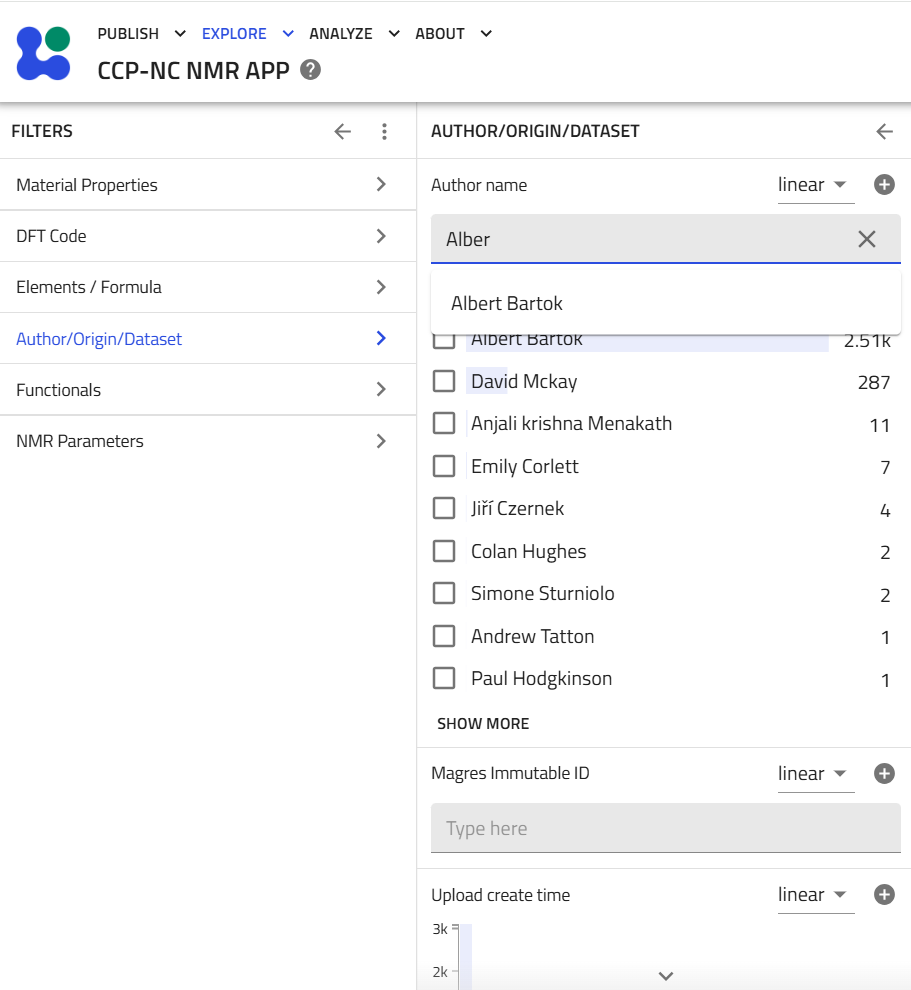
  <figcaption>Typing "Alber" into the Author name box suggests "Albert Bartok"; the checkbox list below is ordered by number of associated records.</figcaption>
</figure>

As with other filter lists, authors are ordered according to the number of records associated with each author. The most frequently occurring author names in the records float to the top of the list and the author names are listed in decreasing frequency of occurrence from the top.

**Using the Global Search Bar**

Begin typing `author` in the global search bar and select the `authors.name` metadata field from the autocomplete suggestions. After selecting the field, enter an equals sign (`=`) followed by the author's name. **Equality** search is strongly recommended. As the author name is being typed, the autocomplete suggestion will offer author name suggestions that most closely match the search string. Click on the option that matches the search criterion and offers **Equality** search.

<figure markdown="1">
  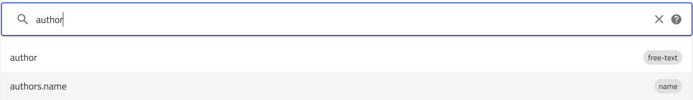
  <figcaption>Selecting <code>authors.name</code> after typing "author".</figcaption>
</figure>

<figure markdown="1">
  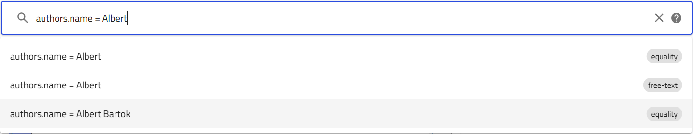
  <figcaption>Choosing the equality search for the full name, "Albert Bartok".</figcaption>
</figure>

**Best Practice**

!!! tip

    Whenever possible, use the **Author** filter panel or an **Equality** search in the Global Search Bar.

---

### Immutable ID (Magres unique identifier)
Each legacy CCP-NC record is assigned a unique **Immutable ID** (historically referred to as the MAGRES ID). This identifier provides one of the most precise methods for locating individual database records.

**Using the Filter Panel**

Immutable IDs are listed within the **Author / Origin / Dataset** filter on the filter panel. The identifier must be entered as a **seven-digit number** with leading zeros.

For example, `0002526` rather than `2526`

<figure markdown="1">
  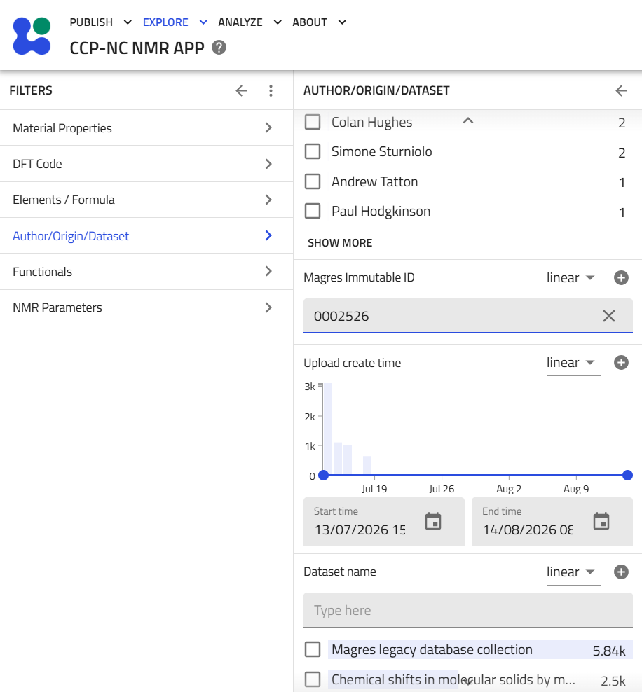
  <figcaption>The Magres Immutable ID box within the Author/Origin/Dataset filter, with the seven-digit identifier <code>0002526</code> entered.</figcaption>
</figure>

**Using the Global Search Bar**

Begin typing `immutable` on the global search bar and select the `data.ccpnc_metadata.ccpnc_record.immutable_id` metadata field.

After selecting the field, enter an equals sign (`=`) followed by the seven-digit identifier. Choose **Equality** search.

<figure markdown="1">
  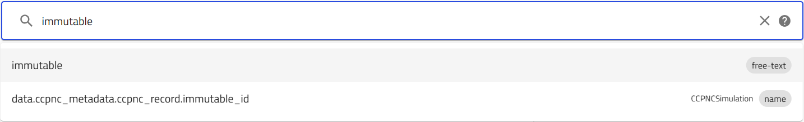
  <figcaption>Selecting <code>data.ccpnc_metadata.ccpnc_record.immutable_id</code> after typing "immutable".</figcaption>
</figure>

<figure markdown="1">
  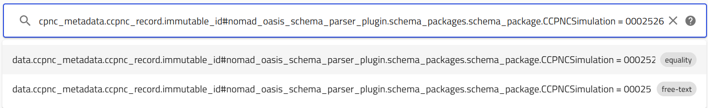
  <figcaption>Applying an equality search for <code>0002526</code>.</figcaption>
</figure>

**Legacy Record Versioning**

!!! warning

    Historically, the legacy CCP-NC Database supported record versioning. Where multiple versions of the same record were deposited, each version shared the same Immutable ID.

    During migration to the CCP-NC Database, these versions became separate records while retaining their original identifier. As a result, a small number of Immutable ID searches may return more than one record. This behaviour is expected and reflects the historical versioning system rather than duplicate identifiers.

    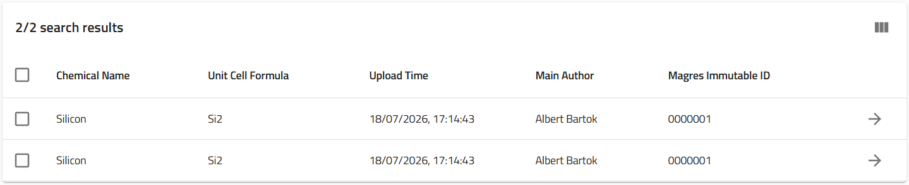
    <small>*An Immutable ID search returning two records — both "Silicon", Si2 — reflecting two versions of the same legacy record.*</small>

**Best Practice**

!!! warning

    Always search using the complete seven-digit Immutable ID.

---

### External Database
Many CCP-NC records contain references to crystal structures in external crystallographic databases, where the authors have made such referencing metadata available. Filtering by external database references allows shortlisting by a reference crystal structure faster.

**Using the Filter Panel**

The **External Database** filter is located within the **Author / Origin / Dataset** section. 

Select the required database from the available list by checking the appropriate checkboxes. This should list every single entry in the database that has a reference to the selected database.

To filter further, one can enter the database reference code from the external database, if known. This search field, by default, performs an **Equality** search (exact-match only).

<figure markdown="1">
  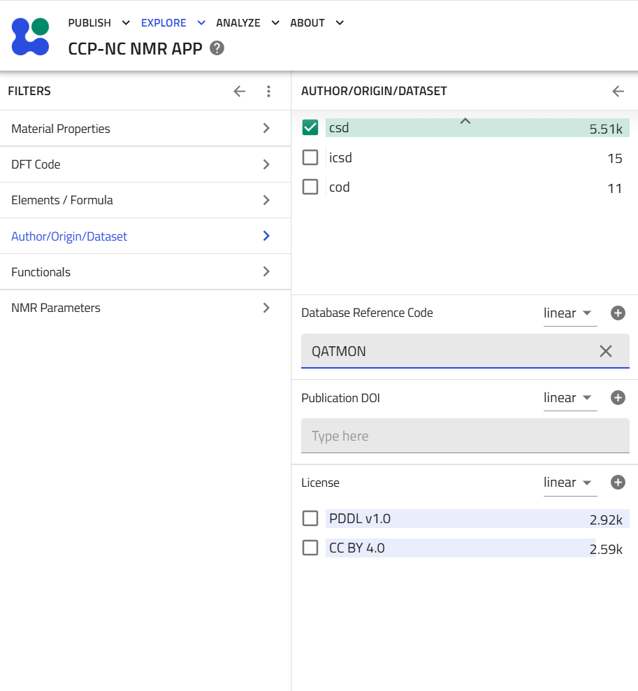
  <figcaption>The <strong>csd</strong> database checked, with reference code <code>QATMON</code> entered in the Database Reference Code box.</figcaption>
</figure>

<figure markdown="1">
  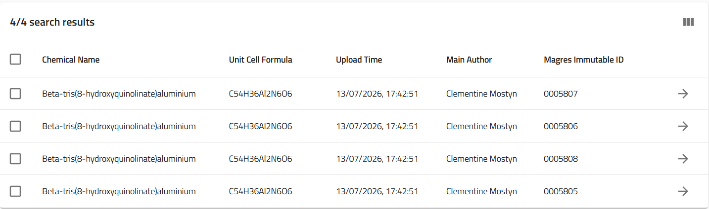
  <figcaption>The 4 records matching the exact reference code <code>QATMON</code>.</figcaption>
</figure>

**Using the Global Search Bar**

Begin typing `external database` in the global search bar and select the `data.ccpnc_metadata.external_database_reference.external_database_name` metadata field.

After selecting the field, type the `=` sign and enter the database name using lowercase notation.

Examples include:

- `csd`
- `icsd`
- `cod`

Choose **Equality** search. Although Free-text search is available, Equality searches provide more reliable results as a partial search for `csd` with returns results containing both `csd` and `icsd`.

To search also by an external database reference code, start typing `external database` in the global search bar and select the `data.ccpnc_metadata.external_database_reference.external_database_reference_code` metadata field from the drop-down menu. Follow it by typing an `=` sign and the exact reference code, choosing **Equality** or **Free-text**search. Please see screenshots and the **Best Practice** section below for how choosing either affects the search results.

<figure markdown="1">
  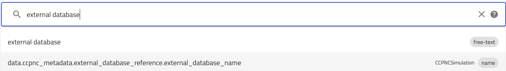
  <figcaption>Selecting <code>data.ccpnc_metadata.external_database_reference.external_database_name</code> after typing "external database".</figcaption>
</figure>

<figure markdown="1">
  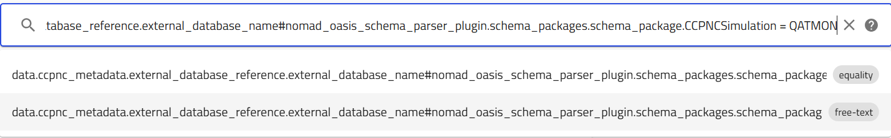
  <figcaption>Entering <code>QATMON</code> and choosing the <strong>free-text</strong> option.</figcaption>
</figure>

<figure markdown="1">
  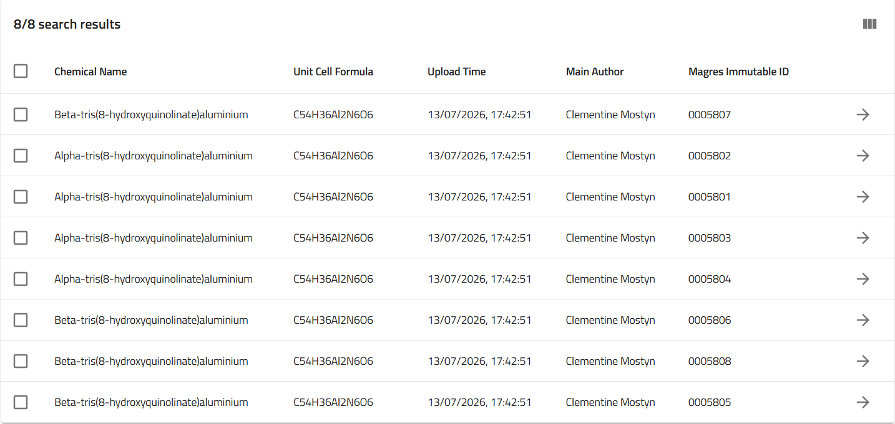
  <figcaption>The free-text search returns 8 records — the base <strong>QATMON</strong> entry plus related structural variants — more than the equality search shown above.</figcaption>
</figure>

**Best Practice**

!!! tip

    - CSD REFCODEs may be searched using either **Equality** or **Free-text** searches.

        For example,

        ```
        QATMON
        ```

        An **Equality** search returns records associated directly with the base REFCODE.

        A **Free-text** search additionally returns related identifiers such as:

        - QATMON01
        - QATMON02

        and other structural variants derived from the same parent entry.

    - ICSD reference numbers are unique numerical identifiers.

        For these identifiers, Equality and Free-text searches generally return the same results.

---

### Publication DOI
Publication DOI searches allow records associated with a particular scientific publication to be located quickly.

**Using the Filter Panel**

Locate the **Publication DOI** filter within the **Author / Origin / Dataset** section. Enter the exact DOI to search and filter, as this search box offers only **Equality** search.

<figure markdown="1">
  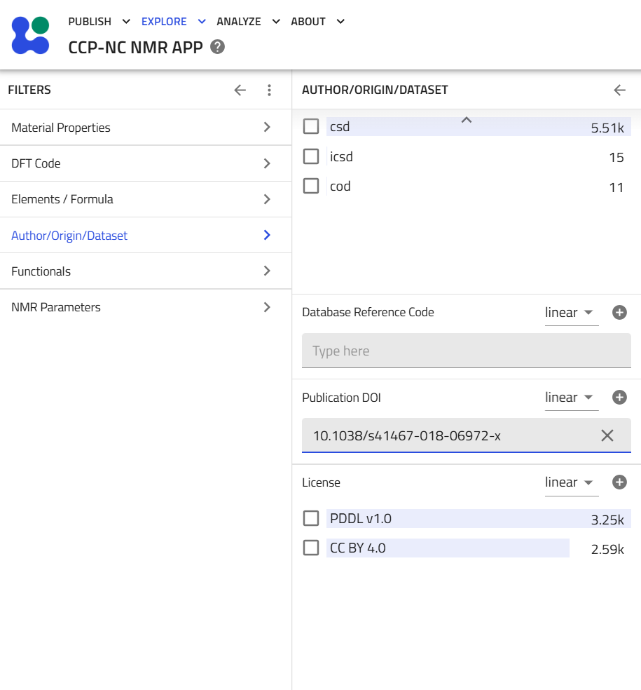
  <figcaption>The Publication DOI box within the Author/Origin/Dataset filter, with a complete DOI entered.</figcaption>
</figure>

**Using the Global Search Bar**

Begin typing `doi` in the search bar and select the `data.ccpnc_metadata.publication_record.doi` metadata field.

After selecting the field, enter an equals sign (`=`) followed by the DOI. For example, for search by partial DOI, one can enter `10.1038` and choose **Free-text** option from the drop-down menu OR, if the exact DOI is known, such as `10.1038/s41557-019-0304-z`, this search string can be entered and **Equality** option can be selected from the drop-down menu for a more refined search.

<figure markdown="1">
  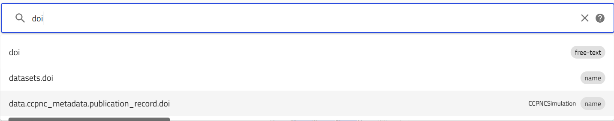
  <figcaption>Selecting <code>data.ccpnc_metadata.publication_record.doi</code> after typing "doi".</figcaption>
</figure>

<figure markdown="1">
  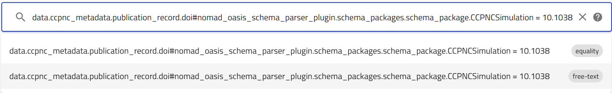
  <figcaption>A partial DOI, <code>10.1038</code>, searched with the <strong>free-text</strong> option.</figcaption>
</figure>

<figure markdown="1">
  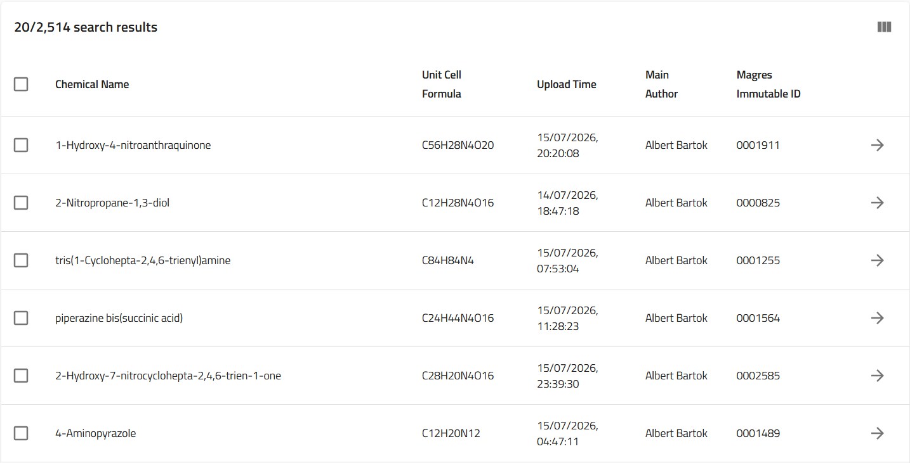
  <figcaption>The 2,514 records matching the free-text DOI fragment.</figcaption>
</figure>

<figure markdown="1">
  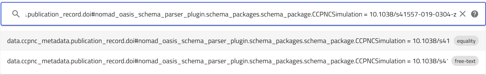
  <figcaption>The complete DOI, <code>10.1038/s41557-019-0304-z</code>, searched with the <strong>equality</strong> option.</figcaption>
</figure>

<figure markdown="1">
  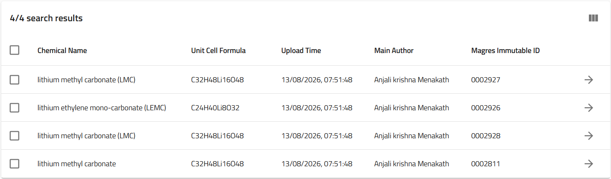
  <figcaption>The 4 records matching the exact DOI.</figcaption>
</figure>

**Best Practice**

!!! tip

    Use **Equality** search whenever the complete DOI is available.

    Reserve **Free-text** searches for situations where only part of the DOI is known.

---

### Exchange-Correlation Functional
The CCP-NC Database allows records to be filtered according to the exchange-correlation (XC) functional used during the electronic structure calculation. This can be particularly useful when comparing computational results generated using different levels of density functional theory.

**Using the Filter Panel**

The **Functionals** filter contains the exchange-correlation functionals represented within the current search results.

The staging database currently includes functionals from several families, including:

- Local Density Approximation (LDA)
- Generalised Gradient Approximation (GGA)
- Hybrid GGA
- Meta-GGA
- Hartree-Fock (HF)

Examples currently represented in the database include:

- LDA
- PBE
- PW91
- RPBE
- WC
- PBESOL
- BLYP
- B3LYP
- PBE0
- HSE03
- HSE06
- RSCAN
- HF

Select one or more functionals using the available checkboxes.

<figure markdown="1">
  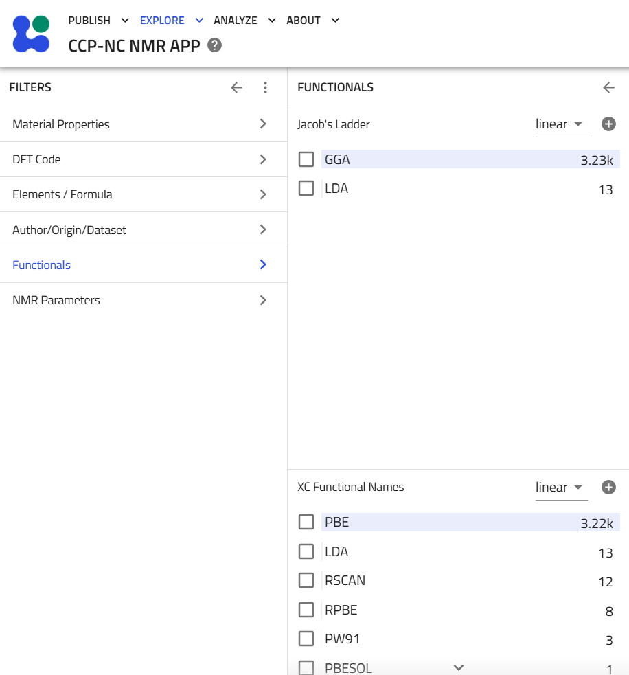
  <figcaption>The Functionals filter, with Jacob's Ladder families (GGA, LDA) and individual XC Functional Names, both ordered by frequency of occurrence.</figcaption>
</figure>

**Using the Global Search Bar**

To filter first by a functional family, begin typing `jacob` in the global search bar and `data.model_method.jacobs_ladder` to select the metadata field from the autocomplete suggestions.

After selecting the field, enter an equals sign (`=`) followed by the functional family name. It is recommended first to search using one of the listed families in **Using the Filter Panel** sub-section above and choosing **Equality** search from the dropdown menu.

<figure markdown="1">
  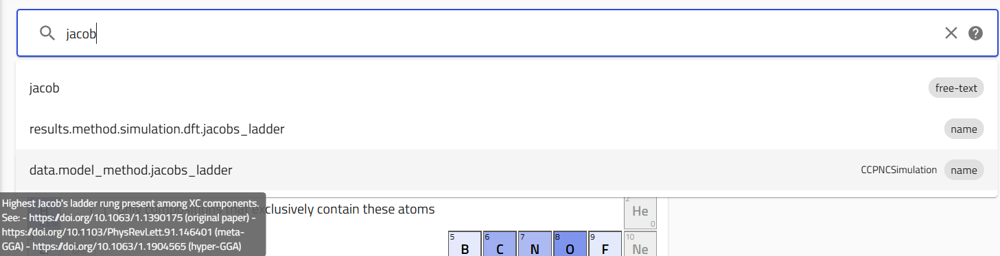
  <figcaption>Selecting <code>data.model_method.jacobs_ladder</code> after typing "jacob".</figcaption>
</figure>

<figure markdown="1">
  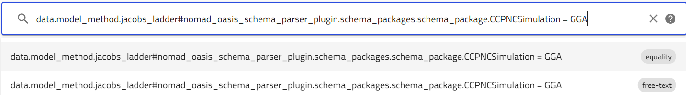
  <figcaption>Applying an equality search for the family <code>GGA</code>.</figcaption>
</figure>

To further filter by a functional name, begin typing `functional` in the global search bar and choosing `data.model_method.xc.functional_key` metadata field from the dropdown menu. As before, type in an `=` sign followed by the functional name to search.

Choose **Equality** search. Although Free-text search is available, Equality searches are recommended because several functional names contain common substrings.

For example,

- PBE
- RPBE
- PBESOL

share similar text and may produce unintended matches when using Free-text searches.

<figure markdown="1">
  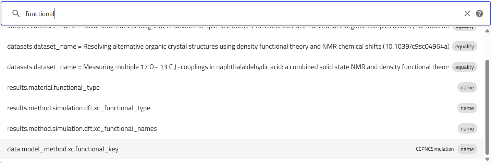
  <figcaption>Selecting <code>data.model_method.xc.functional_key</code> (tagged <strong>CCPNCSimulation</strong>) after typing "functional".</figcaption>
</figure>

<figure markdown="1">
  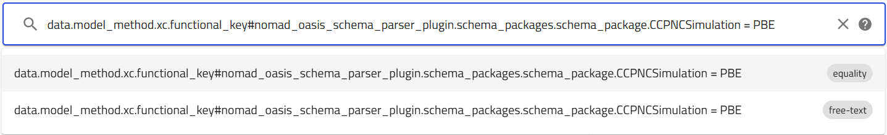
  <figcaption>Applying an equality search for <code>PBE</code>.</figcaption>
</figure>

**Best Practice**

!!! tip

    Equality search should always be used when searching by exchange-correlation functional.

---

### Site-resolved Magnetic Shielding Isotropy (σiso)
One of the principal strengths of the CCP-NC Database is the ability to search computational NMR data directly using calculated site-resolved magnetic shielding values.

Magnetic shielding searches are currently available for the most commonly studied NMR-active elements represented within the database.

**Using the Filter Panel**

The filter panel is the only recommended search method for filtering records by NMR parameters. Within the **NMR Parameters** section, select `Magnetic Shielding (ppm)` and then the element of interest.

The staging deployment currently supports magnetic shielding searches for the common NMR elements listed within the interface. Each element contains an interactive histogram showing the distribution of calculated shielding values across the database.

Adjust the histogram sliders to define the desired search range. Only records containing site-resolved magnetic shielding values within the selected range are returned.

<figure markdown="1">
  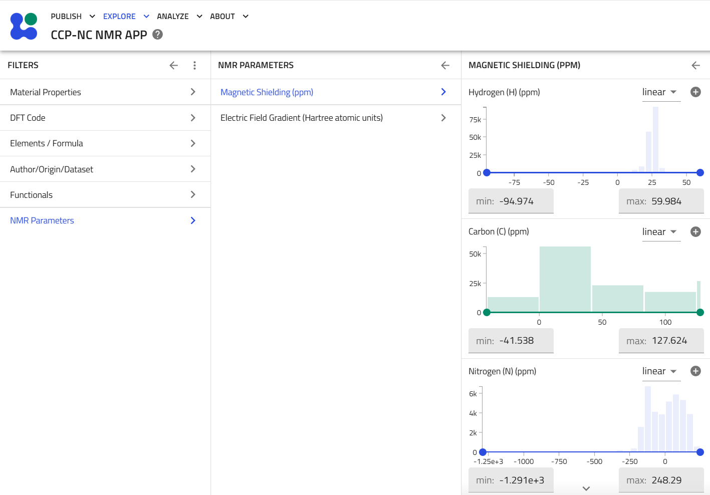
  <figcaption>The Magnetic Shielding (ppm) filter, with histograms and min/max range boxes for Hydrogen, Carbon and Nitrogen.</figcaption>
</figure>

<figure markdown="1">
  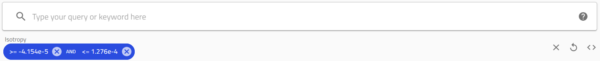
  <figcaption>The resulting applied filter chip, showing the selected isotropy range.</figcaption>
</figure>

---

### Site-resolved Electric Field Gradient (Vzz)
The CCP-NC Database also supports searching using calculated site-resolved electric field gradient (EFG) ``V_zz`` component.

As with magnetic shielding, searches are performed using numerical ranges on the histogram.

**Using the Filter Panel**

The filter panel is the only recommended search method for filtering records by NMR parameters. Within the **NMR Parameters** section, select `Electric Field Gradient (Hartree atomic units)` and then the required element.

Interactive histograms display the distribution of calculated Vzz values currently represented within the database. Adjust the histogram sliders to define the desired numerical range.

Only records containing site-resolved EFG values within the selected range are returned.

<figure markdown="1">
  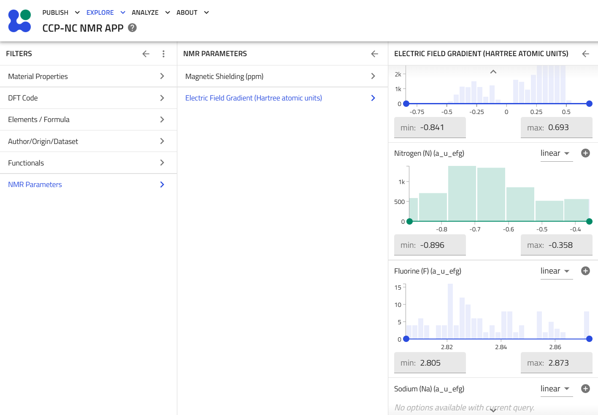
  <figcaption>The Electric Field Gradient filter, with histograms and min/max range boxes for the overall Vzz distribution, Nitrogen and Fluorine.</figcaption>
</figure>

<figure markdown="1">
  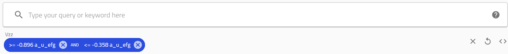
  <figcaption>The resulting applied filter chip: <code>Vzz &gt;= -0.896 AND &lt;= -0.358 a_u_efg</code>, matching the Nitrogen range selected above.</figcaption>
</figure>

---

## Known Limitations

The CCP-NC Database provides multiple complementary search methods. Although most metadata can be searched using either the Filter Panels or the Global Search Bar, users should be aware of current limitations and recommended practices.

### Equality versus Free-text Searches

For structured metadata, **Equality** searches generally provide the most reliable and predictable results.

Free-text searches should primarily be used when:

- searching long material names;
- searching partial publication DOIs; or
- deliberately searching for related external database reference codes.

---

### Short Chemical Formulae

Free-text searches may produce unintended matches for short chemical formulae.

For example,

```text
H4
```

may also match

```text
H14
H24
```

and similar formulae containing the same sequence of characters.

Equality searches are therefore strongly recommended whenever the complete chemical formula is known.

---

### Author Searches

Although both Equality and Free-text searches are available for author names, Equality searches generally provide more reliable and predictable results.

For most users, the **Author** filter panel remains the preferred search method.

---

### Exchange-Correlation Functional Searches

Functionals such as **PBE**, **RPBE** and **PBESOL** share similar text.

To avoid unintended substring matches, Equality searches should always be used.

---

### Numerical NMR Parameter Searches

Although magnetic shielding and electric field gradient quantities are indexed within the underlying search infrastructure, direct numerical range searching through the Global Search Bar is currently limited and not recommended.

Histogram-based filtering within the Filter Panel provides the recommended workflow for these searches.

---

### Staging Deployment

The CCP-NC Database is under active development.

Additional search capabilities, interface improvements and expanded metadata support may be introduced in future releases.
