# Uploading Data

The CCP-NC NMR Database uses the NOMAD Oasis upload infrastructure for data ingestion. This section focuses on the recommended workflow for uploading magres data to the CCP-NC database.

While NOMAD supports a very wide range of first-principles simulation codes, the current staging release of the CCP-NC database is centred around magres files generated using CASTEP and Quantum ESPRESSO. Support for automatically constructing complete NMR workflows directly from DFT code outputs is under active development.

!!! note "Official NOMAD documentation"
    This section focuses on the CCP-NC magres upload workflow. For a complete description of the NOMAD upload interface and all available functionality, please refer to the [official NOMAD documentation](https://docs.nomad-lab.eu/1.4.3/tutorial/upload_publish.html).

---

## Preparing your upload

NOMAD provides parsers for a large number of electronic structure, molecular dynamics and atomistic simulation packages. Any file formats supported by NOMAD Central are also accepted by the CCP-NC NOMAD Oasis.

For the current CCP-NC staging release, users are encouraged to upload **magres files**. Existing parsers for DFT codes such as CASTEP or Quantum ESPRESSO will successfully parse their native output files, but they currently generate independent workflow entries rather than extracting NMR quantities into CCP-NC records. Automatic linkage between DFT workflows and magres data is an active area of development.

**Supported upload formats**

Uploads may consist of:

- individual magres files
- collections of magres files
- folders containing magres files
- compressed ZIP or TAR archives

Compressed archives are unpacked automatically after upload.

For magres uploads, the parser supports multiple directory levels within the uploaded archive and will automatically search for magres files together with their associated metadata files where available.

!!! tip "Recommended workflow"
    If your upload contains multiple folders or many files, compress the entire collection into a single ZIP archive before uploading. This keeps related files together and simplifies transfer.

**Upload size**

Individual uploads may be up to **32 GB** in size.

**File naming**

There are no mandatory naming conventions for magres files.

For bulk uploads using a metadata spreadsheet (see below), the **filename** column in the metadata file **must exactly match** the corresponding magres filename so that metadata can be assigned correctly.

### Metadata requirements

Bulk magres uploads must include a metadata spreadsheet named `metadata_info.csv`, which can be downloaded [here](../assets/files/metadata_info.csv).

The metadata file should be placed inside the uploaded folder or ZIP archive.

If no metadata spreadsheet is supplied, the upload will still be parsed. There is no hard check on the metadata, but in the current staging deployment of the magres database, the absence of metadata will be logged as an error in the processing logs of each entry. 

**Metadata column headers:**
Users are requested to read the metadata descriptions below and follow the instructions to fill in the metadata fields of the input metadata csv file to include with their uploads.

| Column header name | Description | Example |
|---|---|---|
| filename | must exactly match the corresponding magres filename, treated as a `mainfile` | diethylcarbamazine citrate 1.magres |
| chemname | Chemical name assigned to the material, will be stored in `data.ccpnc_metadata.material_properties.chemical_name` | `diethylcarbamazine citrate` (common name) OR an IUPAC name such as `2-(((2,3-Dihydroxypropyl)iminio)methyl)-4-nitrophenolate` |
| license | Data distribution license | One of these values in lowercase `cc-by`, `pddl` or `odc-by` |
| doi | Publication DOI associated with a peer-reviewed work that includes this dataset | Complete doi only, no need to enter doi.org url. For example, just `10.1038/s41557-019-0304-z` a complete DOI is valid |
| chemform | Author free-text notes about the structural descriptors, its polymorphic forms, temperature etc. | A few but not limiting to `Structure at 150K`, `Crystalline form P 1 21/c 1`, `Form I` |
| extref_type | Indicates an external database name which contains the reference crystal structure information | Accepted values are `csd`, `icsd`, `cod`, `other` (lowercase only) |
| extref_other | Other database names not mentioned in the previous row | Enter a lowercase database name, only if the reference is not from one of the above 3 sites, and `other` was entered under `extref_type` |
| extref_code | The unique reference code linking the record to the external database | alphanumeric codes such as `QATMON`, `QATMON01`, etc. for CSD files, unique numeric digits for ICSD and COD files |
| notes | Free-text author notes that can optionally be provided about the structures for the overall upload | No restrictions. This field ia not indexed for searching. Purely optional. |

---

## Starting a new upload

Uploads are created from the **Publish** menu.

<figure markdown="1">
  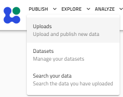
  <figcaption>The Publish menu: Uploads, Datasets, and Search your data.</figcaption>
</figure>

Select:

> **Publish → Uploads**

to open your personal uploads page. Click **Create New Upload**.

<figure markdown="1">
  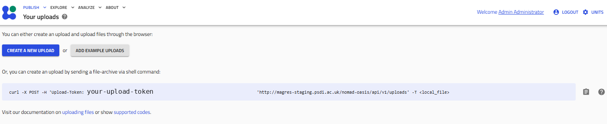
  <figcaption>The Your uploads page: create an upload through the browser, or via a shell command using your personal upload token.</figcaption>
</figure>

A new upload workspace is created where files can be added before publication. The upload page is organised into five stages:

1. Prepare and upload your files
2. Process data
3. Edit visibility and access
4. Edit metadata
5. Publish

<figure markdown="1">
  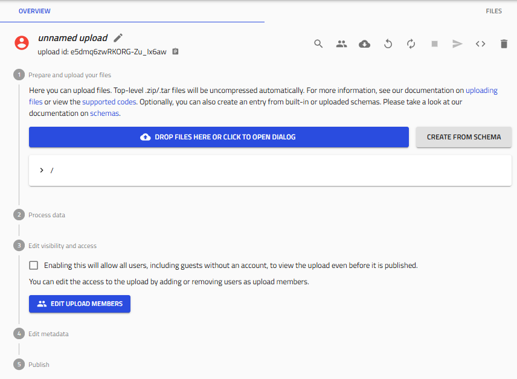
  <figcaption>A new, unnamed upload workspace, showing the five stages: prepare and upload files, process data, edit visibility and access, edit metadata, and publish.</figcaption>
</figure>

Files may be added by:

- clicking **Drop files here or click to open dialog**
- dragging files directly onto the upload area
- dragging folders onto the upload area
- uploading ZIP/TAR archives

Compressed archives are unpacked automatically.

Uploads remain private while unpublished. You may leave the page at any time and continue working on unpublished uploads later.

---

## Magres upload workflows

Two upload workflows are currently recommended.

### Bulk upload using `metadata_info.csv` (recommended)

This is the recommended workflow for publications and large datasets, although the user is not restricted from using this csv metadata route for a single file upload. Prepare a folder containing:

- one or more magres files
- a metadata spreadsheet named `metadata_info.csv`

The spreadsheet contains one row per magres file. The screenshots below show a working example of a bulk upload and metadata preparation.

<figure markdown="1">
  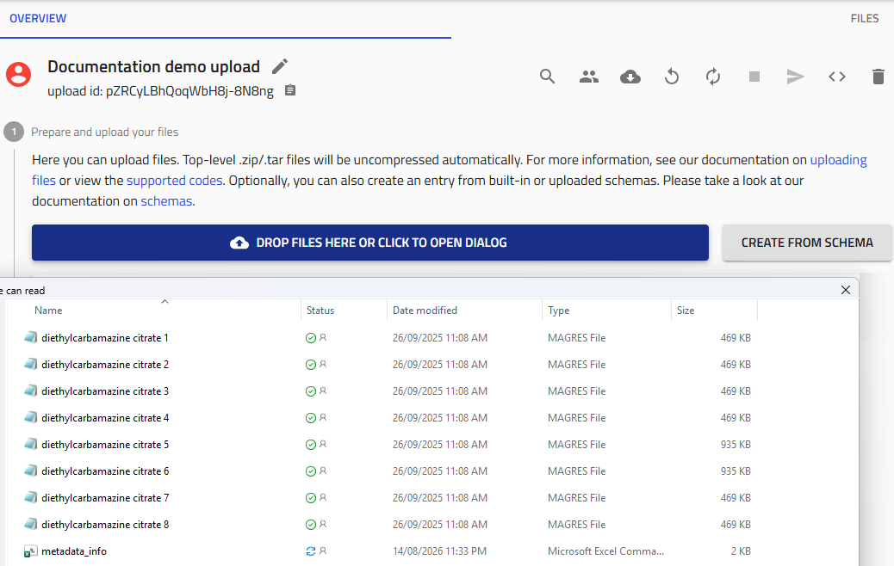
  <figcaption>A folder of MAGRES files uploaded together with a <code>metadata_info</code> spreadsheet, ready for processing.</figcaption>
</figure>

An example metadata spreadsheet is shown below.

<figure markdown="1">
  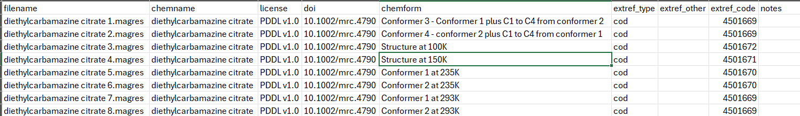
  <figcaption>An example <code>metadata_info.csv</code>, with one row per MAGRES file, and its <code>filename</code> values matching the uploaded files exactly.</figcaption>
</figure>

After selecting or dragging the folder onto the upload area, parsing begins automatically. The below screenshot shows an upload mid-way in the process of getting all uploaded files parsed.

<figure markdown="1">
  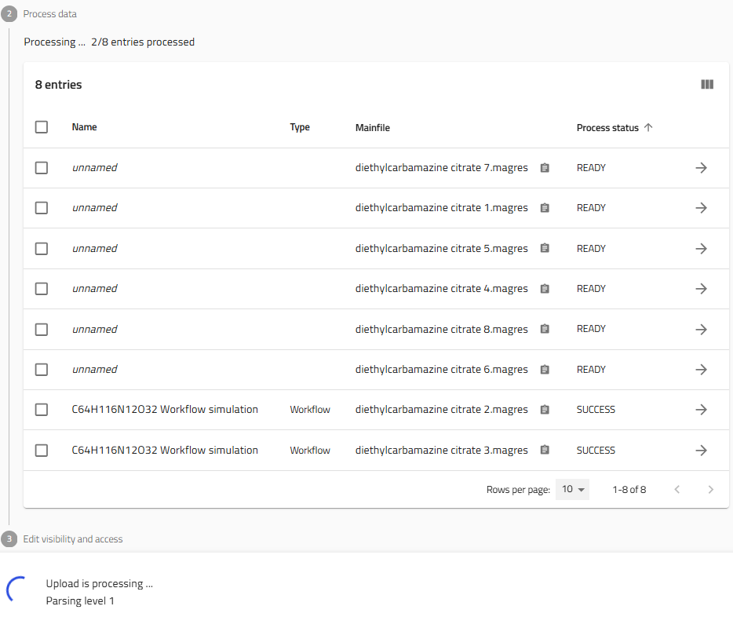
  <figcaption>Parsing in progress: 2 of 8 entries processed so far, with the remaining entries still marked READY.</figcaption>
</figure>

Once processing has completed successfully, each magres file becomes an individual workflow entry.

<figure markdown="1">
  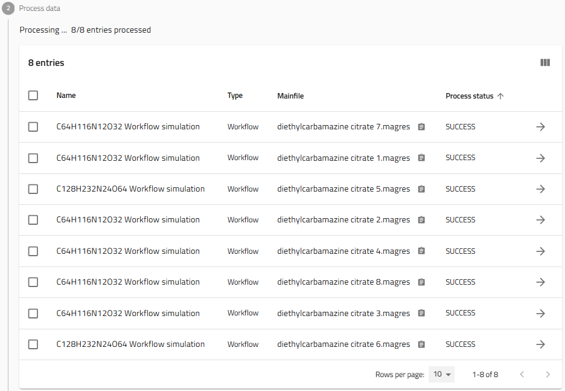
  <figcaption>All 8 entries processed with SUCCESS status, each now shown as an individual workflow simulation entry.</figcaption>
</figure>

### Single magres upload using the ELN

Uploading a single magres file without a metadata spreadsheet triggers a different workflow.

The magres parser extracts all available information from the magres file and automatically creates an accompanying **Electronic Laboratory Notebook (ELN)** metadata entry with the default name `metadata.archive.json`.

<figure markdown="1">
  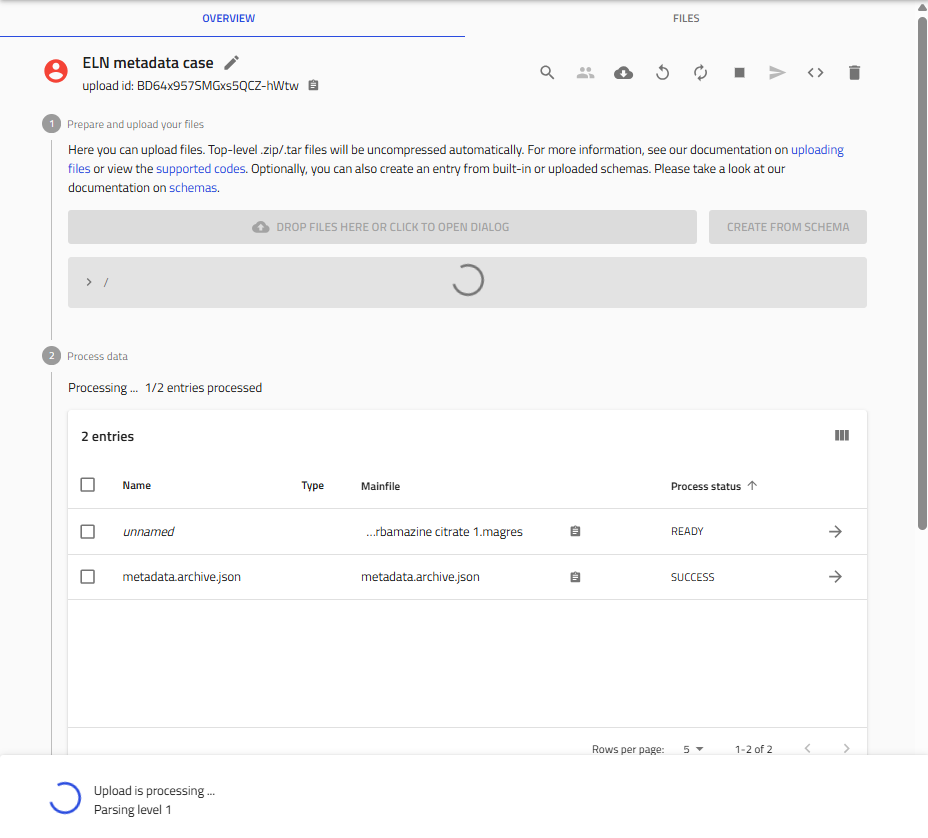
  <figcaption>A single MAGRES file uploaded without a metadata spreadsheet: an accompanying <code>metadata.archive.json</code> ELN entry is created automatically.</figcaption>
</figure>

Open the generated `metadata.archive.json` entry and complete the metadata fields before publication. The `Main Magres Entry` field at the top of the form by default is associated with the single magres file that was uploaded.

<figure markdown="1">
  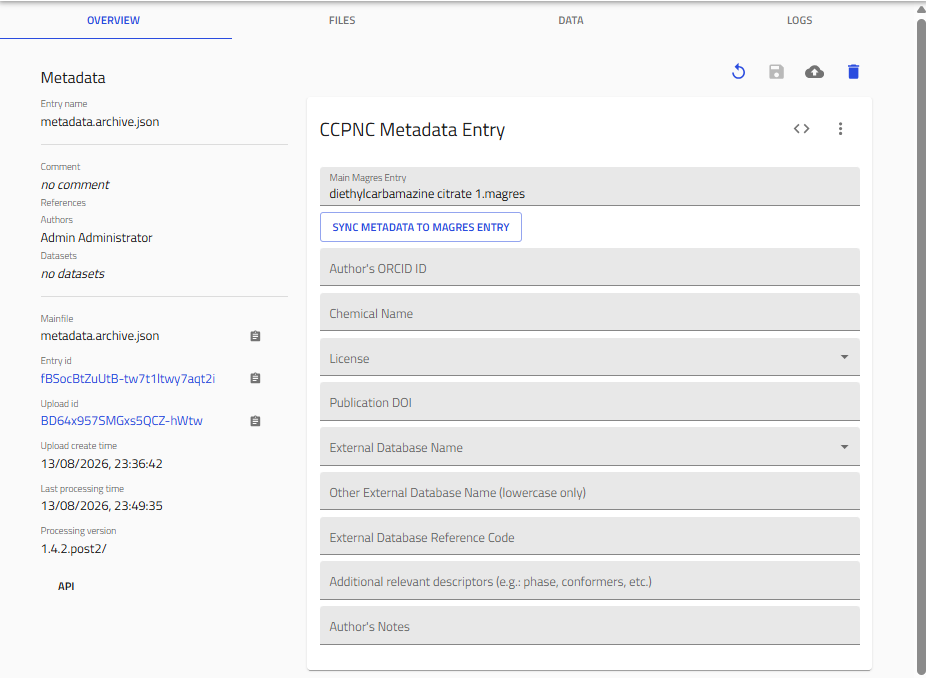
  <figcaption>The CCPNC Metadata Entry form: Main Magres Entry, author's ORCID iD, chemical name, license, publication DOI, external database references, and notes, with the SYNC METADATA TO MAGRES ENTRY button at the top.</figcaption>
</figure>

The metadata fields are straightforward and the instructions for filling them are the same as that of the spreadsheet columns as explained in section [Metadata requirements](#metadata-requirements). The ELN provides fields including:

- Chemical name
- Publication DOI
- Licence
- External database identifiers
- Author information
- Additional notes

Once the metadata fields in the form have been filled in, click the **SYNC METADATA TO MAGRES ENTRY** button at the top of the form to automatically save the notebook and trigger synchronisation of the metadata fields over to the `data.ccpnc_metadata` section of the magres mainfile.

!!! warning "Complete the metadata before publishing"
    The ELN workflow is intended as a convenience feature for single-file uploads. Authors are strongly encouraged to complete the metadata before publishing so that records can be searched correctly and remain FAIR.

---

## Processing uploaded files

Once magres files have been uploaded, parsing begins automatically. Each processed file appears in the **Process data** table together with its processing status.

### Processing status

During processing an entry may progress through several internal states. Users will normally encounter three meaningful states:

| Status | Meaning |
|---------|----------|
| Processing | The parser is still running. |
| SUCCESS | Parsing completed successfully. |
| FAILURE | Parsing failed and requires investigation. |

A **SUCCESS** status indicates that the parser completed without crashing. It does **not** necessarily guarantee that every optional piece of metadata was present. For this reason, it is good practice to inspect the parser logs whenever unexpected results are observed.

### Checking parser logs

Click the arrow next to an entry to open its detailed page. Select the **LOGS** tab to inspect parser messages. The **LOGS** tab was briefly discussed in the [Viewing Results](results.md#logs-tab) section.

<figure markdown="1">
  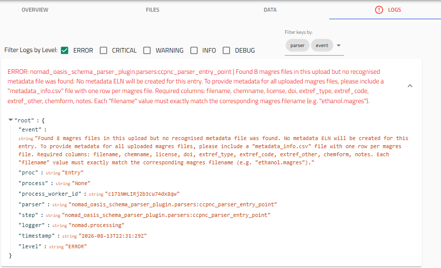
  <figcaption>An ERROR log entry explaining that no <code>metadata_info.csv</code> was found, and listing the required column names.</figcaption>
</figure>

For example, if no `metadata_info.csv` file is found during a bulk magres upload, the parser records an error message in every entry explaining that metadata was not supplied and provides instructions.

### Reprocessing entries

If processing fails or files have been replaced while the upload is still unpublished, the upload can be reprocessed using the **Reprocess** button located at the top of the upload page.

Unpublished entries may also be deleted or replaced.

If repeated processing failures occur, or assistance is required after publication, please contact the [CCP-NC database administrators](../reference/support.md).

---

## Upload metadata

Step 4 of the upload page allows general metadata to be applied to all entries in the current upload.

Click **Edit Metadata of All Entries**.

<figure markdown="1">
  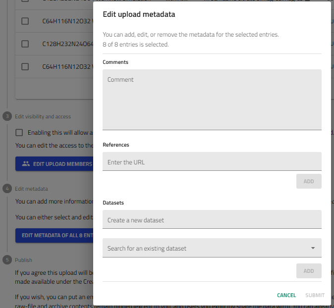
  <figcaption>The Edit upload metadata dialog, applying metadata to all selected entries at once.</figcaption>
</figure>

The metadata entered here is shared across every entry in the upload.

**Comments**

The **Comments** field accepts free-text information describing the upload or publication.

**References**

The **References** field is recommended for recording information that applies to the entire upload, including:

- ORCID identifiers for the main author and co-authors
- Publication DOI entered as a resolvable URL (e.g. https://doi.org/10.1038/s41557-019-0304-z that resolves directly to the publication journal and the published work)
- External database URLs pointing straight to the crystal structure infromation (e.g. https://www.ccdc.cam.ac.uk/structures/Search?Ccdcid=1847785&DatabaseToSearch=Published)
- Other reference links relevant to the uploaded work

Where individual structures have different external database structure identifiers, those should instead be recorded in the `metadata_info.csv` file instead for clarity.

**Datasets**

The dialog also allows entries to be grouped into datasets.

You may:

- create a new dataset
- assign entries to an existing dataset

As described in the [Datasets](datasets.md) section, we recommend using the publication title as the dataset name followed by the DOI in brackets where applicable.

Example:

```
Higher Magnetic Fields, Finer MOF Structural Information (10.1021/jacs.0c02810)
```

---

## Upload members and visibility

By default, uploads are private until published. Additional collaborators may be added before publication. Click **Edit Upload Members**.

<figure markdown="1">
  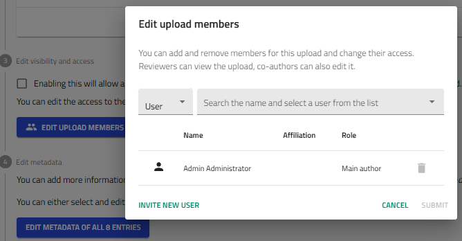
  <figcaption>The Edit upload members dialog: search for an existing user, or invite a new one.</figcaption>
</figure>

Users who already have CCP-NC database accounts can be searched and added directly. If a collaborator has not yet registered, use **Invite New User** to send an invitation. Once added, collaborators can work on the upload alongside the main author.

Visibility of the upload can also be controlled from this stage. Publication embargoes are configured during the final publishing step.

---

## Publishing your upload

Once all files have been processed and metadata has been completed, proceed to **Step 5 – Publish**.

An embargo period may optionally be applied before publication.

<figure markdown="1">
  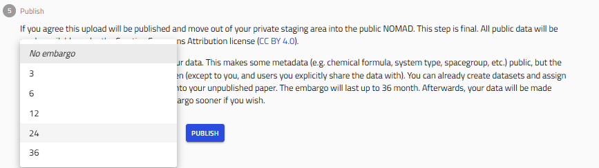
  <figcaption>The embargo period dropdown: No embargo, or 3 to 36 months.</figcaption>
</figure>

Embargoes of up to **36 months** are supported.

By default, NOMAD currently applies the **CC BY 4.0** licence during publication. Future CCP-NC releases will provide additional licence customisation. In the meantime, authors should record their intended licence within the uploaded metadata so that it remains searchable and is included when processed data are exported.

Click **Publish** to begin publication. A confirmation dialog is displayed.

<figure markdown="1">
  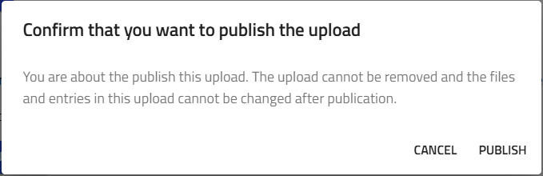
  <figcaption>The publish confirmation dialog, warning that the upload cannot be removed and its files cannot be changed afterwards.</figcaption>
</figure>

Select **Publish** again to continue. Publication may take several moments depending on upload size. Once publication completes:

- the upload icon changes from red to a blue globe
- the upload becomes publicly accessible (subject to any embargo)
- uploaded files can no longer be modified

<figure markdown="1">
  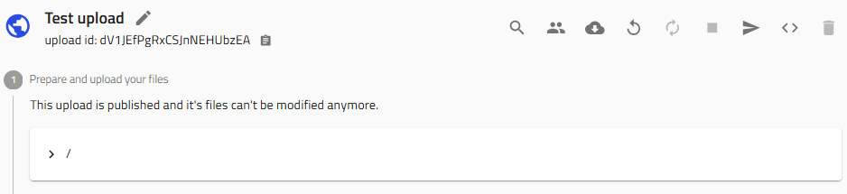
  <figcaption>A published upload: the icon changes to a blue globe, and a notice confirms the files can no longer be modified.</figcaption>
</figure>

!!! warning "Publication is permanent"
    After publication, uploaded files and entries become immutable through the user interface.

    If a published upload requires correction, removal or other administrative changes, please contact the [CCP-NC database administrators](../reference/support.md).
